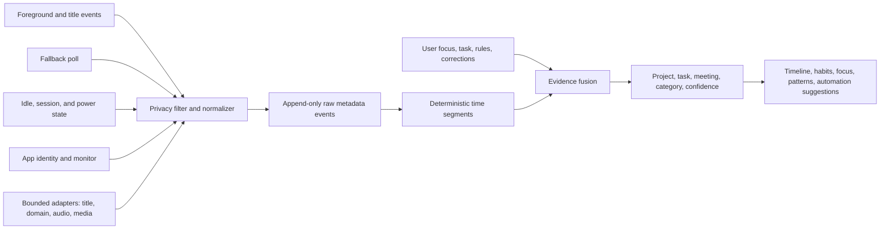

# Ascend activity capture without vision, browser extensions, or MCP

**Deep research report — 8 September 2026**

## Scope and decision

This report answers one narrow product question: how Ascend should understand a person's work on Windows after removing screenshots/OCR/vision, browser extensions, and MCP from the current activity-capture plan.

The recommended design is a **metadata-first sensor-fusion engine**. Ascend should build a trustworthy timeline from Windows foreground-window events, app identity, locally observed window titles, idle/session/power state, and explicit user context. It can add bounded, best-effort adapters for browser domains, app-title parsing, audio-session state, and media-session state. Every inferred label should retain its evidence and confidence.

There is no universal Windows API that can reveal the exact active website, tab, meeting, ticket, document, and task across every app and browser while also using no extension, no app integration, and no visual/content inspection. Ascend should therefore be excellent and honest about the reliable metadata floor, then add context only where it can prove the source.

This direction keeps Ascend personal, local, low-friction, and useful. It does not include team administration, client billing, surveillance, or employee monitoring.

## What Ascend already captures

The active app is the Electron/Python repository at `C:\Users\samar\Desktop\ascend`. Its local branch is newer than both GitHub `main` branches. The working tree also contains more recent productivity changes that are not represented by the current local commit, so GitHub alone is not an accurate picture of the product.

| Current signal | Ascend implementation | What it currently provides | Important gap |
|---|---|---|---|
| Foreground window | [`windows_capture.py`](../src/ascend_engine/productivity/windows_capture.py) uses `GetForegroundWindow` | The one window receiving foreground interaction | Polling can delay a boundary and can miss very short switches |
| Process identity | `GetWindowThreadProcessId` and `QueryFullProcessImageNameW` | App/process identity | Browser process identity still says Chrome, Edge, or Firefox rather than the active site |
| Window title | `GetWindowTextW` | Often includes a document, meeting, ticket, or site name | The `details` setting defaults to off, so the useful title can be omitted from the retained activity |
| Idle state | `GetLastInputInfo` | Separates active use from no recent input | It is activity presence, not intent or productive work |
| Lock state | `OpenInputDesktop` and `GetUserObjectInformationW` | Prevents locked time from being treated as work | Explicit Windows session notifications would produce cleaner boundaries |
| Monitor | `MonitorFromWindow` and `GetMonitorInfoW` | Identifies the monitor containing the active foreground window | It should remain supporting context; only one foreground window should accrue active time |
| Accessibility safety check | [`accessibility.py`](../src/ascend_engine/productivity/accessibility.py) reads focused-element process ID, control type, and password status through an isolated helper | Helps suppress password fields and prevents a stuck provider from blocking tracking | It does not currently retrieve a browser URL, focused element name, or semantic page context |
| Sampling | [`service.py`](../src/ascend_engine/productivity/service.py) polls approximately every two seconds and checkpoints periodically | Simple and recoverable resident collection | A hybrid event-plus-poll design will make boundaries more accurate at lower steady overhead |
| Classification | [`classification.py`](../src/ascend_engine/productivity/classification.py) applies explainable app/title rules | Recognizes several work tools when enough title context exists | No Google Meet term is present, and app-only events cannot distinguish websites |
| User truth | Timeline corrections, focus/project/task context, and rules are already part of the productivity design | Provides the strongest semantic ground truth | Corrections need to become reusable context rules and feed confidence visibly |

The immediate reason Ascend can show only **Chrome** is therefore understandable: Chrome is available from process metadata, while activity details are disabled by default and the accessibility helper does not extract a domain. An exact site cannot be inferred from the Chrome process alone.

## What Rize demonstrates

Rize's strongest transferable idea is not a secret capture API. It is the combination of a narrow metadata stream with categorization, review, rules, history, confidence, and corrections.

Rize's official tracking documentation says it observes the active window and records the application name, window title, URL when available, and timestamps. It says it does not need screenshots, keystrokes, or document contents for ordinary automatic tracking. Its website-tracking documentation also says browser URL availability varies and that a Chrome or Firefox extension can be needed on Windows. [How and What Rize Tracks](https://docs.rize.io/automatic-tracking/tracking-overview), [Tracking Websites](https://docs.rize.io/automatic-tracking/tracking-websites)

Other first-party Rize pages say browser extensions are available, while a marketing and project-management setup page describes extension-free tracking. These claims are not sufficiently consistent to establish Rize's exact private Windows implementation. Ascend should not make a universal URL-capture promise based on them. [Rize FAQ](https://www.rize.io/guides/faq), [Automatic Time Tracking](https://www.rize.io/features/automatic-time-tracking), [Integrations Setup](https://rize.io/features/integrations/setup)

Rize's AI documentation describes a more useful product pattern: combine app names, titles, URLs, user rules, keywords or embeddings, calendar/tasks, and work history; group events into logical blocks; expose confidence; and let corrections improve later categorization. Ascend can apply this pattern locally without making an LLM part of the capture hot path. [Rize AI Features](https://staging.docs.rize.io/automatic-tracking/ai-features)

The Rize features worth adapting are:

- capture only the active context for time accounting;
- make the timeline easy to inspect and correct;
- show why a category, project, task, meeting, or habit was inferred;
- remember user corrections as bounded, editable rules;
- distinguish known context from unknown context rather than guessing;
- preserve exclusions, redaction, and pause controls;
- calculate focus, habits, fragmentation, unplanned work, and repeated workflows from the trustworthy timeline.

## What open-source trackers reveal

The open-source projects converge on the same architecture and limitation.

| Repository | Capture design | Lesson for Ascend |
|---|---|---|
| [ActivityWatch](https://github.com/ActivityWatch/activitywatch) | Separate window, AFK, and browser watchers; the window watcher stores app/title while the browser watcher supplies URL/title/audible/incognito | App metadata and website metadata are separate sensors. The browser extension is the usual reliable URL source, so removing it requires an explicitly weaker fallback |
| [aw-watcher-window](https://github.com/ActivityWatch/aw-watcher-window) | Uses Windows foreground window, title, process path, and a WMI fallback, then sends heartbeats | Ascend's current Windows foundation is conventional and sound; it should improve boundary capture and provenance rather than replace it |
| [Focusd](https://github.com/0xarchit/Focusd) | Polls foreground process/title and recognizes some websites from title patterns | Title catalogs can identify useful browser activity without an extension, but coverage is heuristic rather than universal |
| [TimeScope](https://github.com/EnesAhmet10000/timescope) | Foreground-window and idle polling; precise website domains come from an optional browser extension | Another independent confirmation that OS app tracking and browser URL tracking are different reliability tiers |
| [HPR](https://github.com/plexescor/HPR) | Parses browser and IDE window titles to infer sites or projects | App-specific title parsers can add high-value local context while retaining an evidence trail |
| [WhereDoesTimeGo](https://github.com/fdwr/WhereDoesTimeGo) | Combines a foreground `SetWinEventHook` with timer polling and process/title/class-name fallback | A hybrid event-driven collector with a safety poll is a practical upgrade for Ascend |
| [browser-url](https://github.com/KrishnaV2/browser-url) | Experimental Rust UI Automation extractor for active browser address bars | UI Automation can retrieve a URL in tested browser versions, but the repository's limited support and maturity make it evidence for a spike, not for a universal promise |
| [UIA_Browser](https://github.com/Descolada/UIAutomation/blob/main/Lib/UIA_Browser.ahk) | Browser-specific UI Automation logic reads an address bar or document value | Localization, browser layout, element names, and implementation changes make this inherently adapter-based and version-sensitive |

ActivityWatch's event schema is particularly clear: `currentwindow` holds app/title, `afkstatus` holds active/away state, and `web.tab.current` holds URL/title/audible/incognito. Ascend can follow the separation even though it has intentionally removed the extension-based web sensor. [ActivityWatch buckets and events](https://github.com/ActivityWatch/docs/blob/master/src/buckets-and-events.rst)

## Capture methods available on Windows

### Tier 1 — reliable core signals

| Signal | Windows mechanism | Value | Reliability and limits | Recommendation |
|---|---|---|---|---|
| Foreground changes | `SetWinEventHook(EVENT_SYSTEM_FOREGROUND)` | Exact transition to a new foreground window | Ordered out-of-context events require a message loop; callbacks must handle reentrancy | Make this the primary boundary trigger, with the existing poll as recovery. [SetWinEventHook](https://learn.microsoft.com/en-us/windows/win32/api/winuser/nf-winuser-setwineventhook), [Event constants](https://github.com/MicrosoftDocs/win32/blob/docs/desktop-src/WinAuto/event-constants.md) |
| Title changes | `EVENT_OBJECT_NAMECHANGE`, followed by `GetWindowTextW` | Detects a tab/document/meeting-title change within the same window | Some providers may not raise every accessibility event | Subscribe where useful and retain a fallback sample. [UI Automation events](https://learn.microsoft.com/en-us/windows/win32/winauto/uiauto-eventsforclients) |
| App/process identity | PID, executable name, `QueryFullProcessImageNameW`, window class, optional AUMID | Distinguishes desktop apps, packaged apps, browser families, and some app surfaces | Full paths may expose usernames or project names and should not be stored by default | Persist a normalized identity; keep raw paths transient. [QueryFullProcessImageNameW](https://learn.microsoft.com/en-us/windows/win32/api/winbase/nf-winbase-queryfullprocessimagenamew), [GetClassName](https://learn.microsoft.com/lb-lu/windows/win32/api/winuser/nf-winuser-getclassnamew), [GetApplicationUserModelId](https://learn.microsoft.com/en-us/windows/win32/api/appmodel/nf-appmodel-getapplicationusermodelid) |
| Idle state | `GetLastInputInfo` | Separates active input periods from idle periods | It is per-session and its tick value is not a semantic activity label | Keep it; never record individual keys, clicks, or mouse paths. [GetLastInputInfo](https://learn.microsoft.com/es-es/windows/win32/api/winuser/nf-winuser-getlastinputinfo) |
| Lock/logon/session state | `WTSRegisterSessionNotification` and `WM_WTSSESSION_CHANGE` | Clean lock, unlock, logon, logoff, and remote-session boundaries | Requires a receiving window/message loop | Add it so time blocks close immediately on lock and reopen cleanly on unlock. [WTS session changes](https://learn.microsoft.com/en-us/windows/win32/termserv/wm-wtssession-change), [WTS registration](https://learn.microsoft.com/en-us/windows/win32/api/wtsapi32/nf-wtsapi32-wtsregistersessionnotification) |
| Sleep/resume | Windows power-management events | Prevents sleep time from becoming an unexplained gap or active block | A critical suspension may occur without advance notification | Add explicit resume reconciliation and retain gap detection. [System power events](https://learn.microsoft.com/en-us/windows/win32/power/system-power-management-events) |
| Active monitor | Foreground-window monitor APIs | Useful for understanding workspace switching across multiple displays | Does not reveal content on passive monitors and must not create parallel active time | Keep as supporting context only |

Microsoft recommends automation events as a way to avoid constant polling, but also notes that providers do not necessarily raise every event. That supports a hybrid collector: events establish fast boundaries, while a low-rate poll repairs missed transitions. [UI Automation events](https://learn.microsoft.com/en-us/windows/win32/winauto/uiauto-eventsforclients)

### Tier 2 — bounded semantic adapters

| Signal | Method | What it can add | Limits | Ascend policy |
|---|---|---|---|---|
| App and site title semantics | Versioned parsers for Chrome/Edge/Firefox, Meet, ClickUp, Slack, WhatsApp, Gmail, Docs, Office, VS Code, JetBrains, and other high-value apps | Meeting name, ticket/task hint, document name, IDE project, and likely site | Titles vary by app, locale, account, and version; multiple contexts can share a title | Run locally, record the matched rule, and let users correct it |
| Browser domain | UI Automation address-bar `Value` or equivalent browser element | Exact domain, and optionally a redacted path, from the active browser window | Browser/version/localization dependent; providers can time out; private mode needs fail-closed handling; full URLs may contain secrets | Implement as an isolated, time-limited adapter after a test matrix. Store domain by default; store full URL only under an explicit setting |
| Focused control metadata | UI Automation properties and patterns | Can distinguish password fields, editable controls, documents, and some app surfaces | Automation IDs can change across builds and names can be localized; full tree inspection becomes content surveillance | Keep password and control-type safety checks. Do not crawl page/document content. [UIA properties](https://learn.microsoft.com/en-us/windows/win32/winauto/uiauto-propertiesforclients), [UIA testing guidance](https://learn.microsoft.com/en-us/windows/win32/winauto/uiauto-usefortesting), [Edit control type](https://learn.microsoft.com/en-us/windows/win32/winauto/uiauto-supporteditcontroltype) |
| Audio-session state | Core Audio session enumeration and process IDs | Evidence that a process is rendering or capturing audio, useful for meeting/media corroboration | Active audio does not identify the browser tab or prove a meeting; browser processes complicate attribution | Capture only active/inactive state and normalized process identity; never audio content. [Audio session state](https://learn.microsoft.com/en-us/windows/win32/api/audiopolicy/nf-audiopolicy-iaudiosessioncontrol-getstate), [Audio process ID](https://learn.microsoft.com/en-us/windows/win32/api/audiopolicy/nf-audiopolicy-iaudiosessioncontrol2-getprocessid), [Audio session enumeration](https://learn.microsoft.com/en-us/windows/win32/api/audiopolicy/nn-audiopolicy-iaudiosessionenumerator) |
| System media session | `Windows.Media.Control` / Global System Media Transport Controls | Playback state and metadata for media apps that register a system session | Many apps and web tabs do not participate; metadata can describe entertainment rather than work | Use as optional corroboration for media and learning habits, never as universal activity truth. [Windows media control](https://learn.microsoft.com/en-us/uwp/api/windows.media.control?view=winrt-26100) |
| Selected-folder changes | `ReadDirectoryChangesW` on explicit project folders | Evidence that a chosen project is receiving file changes | Noisy, not equivalent to active work, and filenames may be sensitive | Consider later only as per-folder opt-in, aggregated and locally stored. [Directory change notifications](https://learn.microsoft.com/en-us/windows/win32/fileio/obtaining-directory-change-notifications) |
| User-declared context | Focus task, project, client task, correction, offline/manual block | Direct statement of intent and the strongest project/task label | Requires occasional user input | Make this effortless and use it to teach editable local rules |

UI Automation is not the same as vision: it queries the accessibility tree exposed by an application. Chromium documents both its Windows accessibility support and the complexity caused by browser and renderer processes. Ascend should treat browser extraction as a maintained adapter, not as a generic Windows capability. [Chromium Windows accessibility](https://www.chromium.org/developers/accessibility/windows-accessibility/), [Chromium accessibility architecture](https://new.chromium.org/developers/design-documents/accessibility/)

A browser accessibility adapter is installed once with Ascend and observes the active window across Chrome profiles. It does not require installation in each profile. Its limitations are browser implementation, localization, private mode, and version changes rather than profile installation.

### Tier 3 — sources that should not drive Ascend tracking

| Method | Why it is tempting | Why it should be rejected or deferred |
|---|---|---|
| Browser history databases | Local, no browser extension | Retrospective rather than active-duration data; split across profiles; databases can be locked; private browsing is absent; URLs may expose sensitive queries and tokens |
| Chrome DevTools remote debugging | Precise tabs and URLs | Requires browser launch flags or a debug port, adds setup and attack surface, and is unsuitable as a default personal tracker |
| DNS, packet capture, or Windows Filtering Platform | Can reveal contacted domains or process traffic | CDNs, encrypted protocols, background tabs, service workers, and shared browser processes prevent reliable active-tab attribution; WFP adds driver/admin complexity. [Windows Filtering Platform](https://learn.microsoft.com/en-us/windows/win32/fwp/about-windows-filtering-platform) |
| Event Tracing for Windows | Rich system and application telemetry | Built for tracing/diagnostics, not semantic task identification; events can be missing and the volume/privacy cost is disproportionate. [Event Tracing for Windows](https://learn.microsoft.com/en-us/windows/win32/etw/about-event-tracing) |
| Low-level keyboard and mouse hooks | Fine-grained interaction counts | Unnecessary because idle state answers the useful question; creates keylogging risk and does not reveal intent |
| Clipboard contents | May contain copied task or document context | Highly sensitive and weakly connected to time; even Windows' clipboard listener only indicates a change without making the content appropriate to retain. [Clipboard listener](https://learn.microsoft.com/en-nz/windows/win32/api/winuser/nf-winuser-addclipboardformatlistener) |
| Notification contents | Can reveal task, message, and meeting names | Captures information the user may not be working on, creates privacy noise, and does not measure active time |
| Full accessibility-tree/document scraping | Can expose page text without screenshots | Becomes content surveillance, creates large noisy data, and is fragile across apps. Restrict UIA to the smallest properties required for identity and safety |
| System-wide filesystem watching | Can reveal edited projects | Background sync and build artifacts overwhelm intent, while file paths leak sensitive context; selected-folder opt-in is the only defensible form |
| Screenshots, OCR, or vision | Broad context | Explicitly removed from the current design |
| Browser extension or Chrome-extension MCP | Reliable browser tab metadata | Explicitly removed because of per-browser/profile setup and product friction |
| MCP or provider integration as the tracker | Rich task-system context | An enrichment may explain a task later, but it cannot be the universal source of what the user is actively doing and is explicitly out of the current capture plan |

## Recommended Ascend capture architecture

The capture path must remain deterministic and fast. An LLM must never decide whether an event is stored or whether time continues. The pipeline should work as follows:

1. **Collect:** `SetWinEventHook` captures foreground changes and relevant name changes. The existing two-second poll becomes a low-frequency recovery mechanism rather than the primary sensor.
2. **Normalize:** map a transient PID/path/window handle to a stable local app identity using executable name, class, and AUMID where available.
3. **Protect:** suppress password managers, password controls, private-mode data that cannot be handled safely, user exclusions, and title/URL secrets before durable storage.
4. **Segment:** close and open time blocks deterministically on foreground, title, idle, lock, sleep, resume, pause, and manual-correction boundaries.
5. **Enrich:** run versioned title/domain/audio/media adapters outside the capture callback. Each has a short timeout and may return `unknown` without interrupting tracking.
6. **Fuse:** derive app, site, meeting, project, task, and category from the available evidence. Deterministic rules run first. A local text model can later help classify sanitized metadata, asynchronously and with a cache.
7. **Explain:** persist the source IDs, matched rule, confidence, model/rule version, and whether the value was inferred or user-confirmed.
8. **Learn:** a correction proposes an editable local rule, such as “titles containing `Support queue` in Chrome map to CX Support.” The raw timeline remains append-only and derived labels remain rebuildable.

Suggested evidence levels:

- **Confirmed:** user-selected focus/project/task or a user-approved rule matched unambiguously.
- **High confidence:** exact normalized app plus an observed domain or a unique title rule.
- **Probable:** multiple independent clues agree, such as a Meet title plus active browser audio.
- **Unknown:** only a generic browser/app is known. The UI should say “Chrome — site unavailable,” not manufacture a site or task.

## Google Meet example

With the recommended sensors, Ascend could receive:

- foreground app: `chrome.exe`;
- window title: `Weekly CX review - Google Meet`;
- UI Automation domain, when available: `meet.google.com`;
- Chrome audio session: active;
- current user focus: `CX weekly review`.

It can then display **Google Meet · Weekly CX review · CX weekly review — high confidence**, with an explanation showing the domain, title rule, audio corroboration, and user focus. If the domain adapter fails but the title matches, the result becomes **Google Meet — probable**. If only `chrome.exe` is available, the correct result is **Chrome — unknown site**.

This is much more trustworthy than silently converting every Chrome audio session or vague title into a meeting.

## Build sequence

### Phase 0 — make current data usable

- Replace the vague “details” switch with a clear local-activity-details setting and an explanation of what titles add.
- During the personal beta, enable local title-based categorization by default after a transparent first-run disclosure; retain one-click exclusions and private/password suppression.
- When details are off or unavailable, show the reason: “site unavailable because activity details are off” or “this browser did not expose a domain.”
- Add a Google Meet title rule and provenance; do not label Meet when the evidence is only Chrome.

### Phase 1 — trustworthy Windows timeline

- Add a `SetWinEventHook` foreground listener and targeted name-change events.
- Retain a two-to-five-second fallback poll and periodic checkpoint.
- Add normalized executable/class/AUMID identity.
- Add explicit WTS lock/unlock and power sleep/resume boundaries.
- Store source, confidence, rule version, and redaction reason with every derived context.

### Phase 2 — local semantic title catalog

- Create versioned, testable parsers for the highest-value apps and browser-title patterns.
- Start with Meet, ClickUp, Asana, Slack, WhatsApp, Gmail, Docs/Sheets, Office, VS Code, JetBrains, terminal shells, and media apps.
- Convert repeated user corrections into suggested rules that the user can accept, edit, disable, and delete.
- Keep an “unknown context” queue so coverage problems are visible and prioritized from real use.

### Phase 3 — browser-domain accessibility spike

- Build a separate helper that queries only the active address-bar/document URL property with a strict timeout.
- Start with the installed Chrome and Edge versions, then test Firefox.
- Normalize to scheme plus domain or domain only; remove query strings, fragments, credentials, and known secret-bearing paths before storage.
- Test all local browser profiles, multiple windows, normal/private modes, different zoom/display scales, browser updates, and localization.
- Fail closed in private mode or when mode cannot be determined safely.
- Ship only for tested browser/version combinations and label unsupported cases honestly.

### Phase 4 — meeting and media corroboration

- Add process-level audio-session active state without recording audio.
- Add SMTC playback state where available.
- Fuse audio/media only with app/title/domain evidence. Never use audio state alone to infer a meeting or productive work.

### Phase 5 — habits and improvement layer

- Measure focus blocks, context switching, interruption recovery, planned versus unplanned work, meeting load, category balance, repeated task sequences, and after-hours patterns from the corrected timeline.
- Generate automation suggestions only after a sequence repeats enough times and show the supporting occurrences.
- Keep any optional local model asynchronous, metadata-only, replaceable, and unable to rewrite raw activity.

## Acceptance and research tests

Before calling the system reliable, Ascend should pass a measured dogfood study rather than a demo-only test:

1. Compare event-plus-poll segments with a temporary high-rate QA observer during scripted app, tab, and title switches.
2. Confirm that four monitors still produce one active-time stream and never double-count passive windows.
3. Verify exact behavior for idle, lock, unlock, sleep, resume, crash, restart, pause expiry, and Windows startup.
4. Run a browser matrix covering every installed profile, multiple windows, normal/private modes, supported browser versions, and UIA helper timeout/crash cases.
5. Verify that password managers, password controls, private mode, excluded apps, and redaction rules produce no retained sensitive values.
6. Record CPU, memory, wakeups, and battery impact for a ten-hour day.
7. Measure coverage from real use: percentage of active minutes with app only, useful title, verified domain, inferred meeting, user-confirmed project/task, and unknown context.
8. Measure correction rate and rule precision by category instead of claiming a global AI accuracy number.
9. Rebuild all derived blocks from raw events and confirm identical duration totals.
10. Surface provenance in the UI so every label can answer “How did Ascend know this?”

The first baseline should determine numerical launch thresholds. Inventing an accuracy target before measuring the user's actual mix of apps and browser contexts would encourage false confidence.

## Final product recommendation

Build the trustworthy Windows metadata timeline first, then a title-parser catalog, then a browser-domain UI Automation experiment, and finally audio/media corroboration. This gives Ascend meaningful Google Meet, ClickUp, WhatsApp, Slack, document, and coding context with one app install and no per-profile setup, while preserving an honest fallback to app-only tracking.

The key product feature is not merely collecting more signals. It is converting limited local evidence into an inspectable memory: what Ascend observed, what it inferred, how confident it is, what the user corrected, and what behavior pattern the evidence supports. That foundation can power focus, habits, repeated-work detection, automation suggestions, dictation context, meeting memory, and the longer-term personal agent without rebuilding the capture layer.

## Primary sources

### Ascend and Rize

- Current Ascend source and documents in `C:\Users\samar\Desktop\ascend`
- [Rize tracking overview](https://docs.rize.io/automatic-tracking/tracking-overview)
- [Rize website tracking](https://docs.rize.io/automatic-tracking/tracking-websites)
- [Rize first-time setup](https://docs.rize.io/getting-started/first-time-setup)
- [Rize FAQ](https://www.rize.io/guides/faq)
- [Rize automatic tracking](https://www.rize.io/features/automatic-time-tracking)
- [Rize integrations setup](https://rize.io/features/integrations/setup)
- [Rize AI features](https://staging.docs.rize.io/automatic-tracking/ai-features)

### Open-source implementations

- [ActivityWatch](https://github.com/ActivityWatch/activitywatch)
- [ActivityWatch Windows watcher](https://github.com/ActivityWatch/aw-watcher-window)
- [ActivityWatch event model](https://github.com/ActivityWatch/docs/blob/master/src/buckets-and-events.rst)
- [Focusd](https://github.com/0xarchit/Focusd)
- [TimeScope](https://github.com/EnesAhmet10000/timescope)
- [HPR](https://github.com/plexescor/HPR)
- [WhereDoesTimeGo](https://github.com/fdwr/WhereDoesTimeGo)
- [browser-url](https://github.com/KrishnaV2/browser-url)
- [UIA_Browser](https://github.com/Descolada/UIAutomation/blob/main/Lib/UIA_Browser.ahk)

### Windows and Chromium platform documentation

- [SetWinEventHook](https://learn.microsoft.com/en-us/windows/win32/api/winuser/nf-winuser-setwineventhook)
- [Windows accessibility event constants](https://github.com/MicrosoftDocs/win32/blob/docs/desktop-src/WinAuto/event-constants.md)
- [UI Automation events](https://learn.microsoft.com/en-us/windows/win32/winauto/uiauto-eventsforclients)
- [UI Automation properties](https://learn.microsoft.com/en-us/windows/win32/winauto/uiauto-propertiesforclients)
- [UI Automation testing guidance](https://learn.microsoft.com/en-us/windows/win32/winauto/uiauto-usefortesting)
- [WTS session notifications](https://learn.microsoft.com/en-us/windows/win32/termserv/wm-wtssession-change)
- [System power events](https://learn.microsoft.com/en-us/windows/win32/power/system-power-management-events)
- [Core Audio session state](https://learn.microsoft.com/en-us/windows/win32/api/audiopolicy/nf-audiopolicy-iaudiosessioncontrol-getstate)
- [Windows media control](https://learn.microsoft.com/en-us/uwp/api/windows.media.control?view=winrt-26100)
- [Chromium Windows accessibility](https://www.chromium.org/developers/accessibility/windows-accessibility/)
- [Chromium accessibility architecture](https://new.chromium.org/developers/design-documents/accessibility/)
