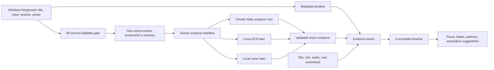

# Ascend activity intelligence implementation plan

**Status:** Owner pilot implements the core of Phases 1–4 and part of Phase 5; the 2026-09-09 audit records remaining release gaps

**Scope:** Personal Windows productivity tracking

**Related research:** [Activity capture research](ACTIVITY-CAPTURE-RESEARCH-2026-09-08.md)

## Decision recorded by this plan

Ascend will combine continuous Windows metadata with periodic screen understanding.

- Windows metadata remains the authoritative source for time boundaries and active/idle state.
- Ascend may capture at most one screenshot every 60 seconds from the monitor containing the foreground active window.
- A capture is eligible only when activity or tracked foreground context changed since the previous opportunity.
- Other monitors are not captured during that interval.
- Screenshots remain in memory through analysis and evidence commit. Ascend verifies the database receipt, erases its pixel buffer, and then records the deletion confirmation.
- The first screen-understanding provider will be Anthropic Claude Haiku 4.5, returning bounded structured data.
- Local OCR remains part of the architecture through a common analyzer interface, but its implementation is deferred until the metadata-and-vision path is measured.
- A Chrome/browser extension is excluded.
- MCP is excluded from activity capture.
- Team administration, employee monitoring, client billing, screenshot galleries, and continuous screen recording are excluded.

This plan updates the earlier research scope that temporarily excluded screenshots and vision. The research remains useful for the metadata design; this document is the current implementation sequence for screen understanding. Existing security and architecture gates still apply to implementation.

## Why this order

One-minute screenshots cannot produce trustworthy time accounting by themselves. They may miss short switches and cannot determine the exact transition time between activities. Windows metadata can do that continuously at negligible cost.

Vision provides a different benefit: it can understand the visible application surface, meeting, task, ticket, document, or workflow when app/process metadata is too generic. It should enrich the timeline rather than create the timeline.

The order is therefore:

1. make Windows timing and activity signals trustworthy;
2. prove safe single-monitor screenshot capture without transmitting anything;
3. add Claude Haiku analysis with strict data and cost controls;
4. fuse vision with titles, accessibility, and audio evidence;
5. improve corrections and the timeline;
6. add local OCR later if cost, privacy, offline use, or exact-text extraction justifies it.

Habits, coaching, and repeated-work suggestions are outside this implementation slice by founder direction. Existing simple productivity summaries remain, but this work does not expand them.

## Implemented owner-pilot state

- A WinEvent listener observes foreground and title changes; a hidden Windows message window observes lock/unlock, suspend/resume, and display changes. The two-second sampler remains the repair path.
- Foreground observations include executable, normalized title, monitor, native window class, packaged application identity, idle time, and bounded UI Automation safety/context data.
- Local adapters recognize selected meeting, communication, planning, document, development, and media surfaces from domain, title, or application identity.
- Core Audio distinguishes foreground-process output and input activity without recording sound.
- The 60-second scheduler requires activity or a Windows context event, a resolvable foreground monitor, a successful UI Automation safety check, configured vision, and remaining daily allowance.
- Vision evidence and operational usage are stored in the encrypted local vault. Screenshot bytes have no file or database field. Pixel erasure occurs only after an evidence receipt is read back; the deletion receipt retries idempotently.
- Timeline rows expose evidence provenance and confidence and retain the existing category, project, task, planning, and correction workflow.

Known pilot limits: browser domain capture is available only when Windows UI Automation exposes the focused address field; otherwise title adapters and vision provide context. Lock/sleep behavior is wired to Windows notifications but still needs manual hardware exercise. Multi-monitor capture uses the monitor containing the verified foreground window and still requires four-monitor dogfooding. Phase 5 does not yet provide service/surface correction, manual split/merge, an unknown-context queue, individual evidence deletion, or skipped-capture reasons.

## Target architecture



The Python engine continues to own capture, policy, time accounting, model calls, validation, and storage. The Electron renderer displays state and sends typed user actions; it never receives the provider credential or raw screenshots.

## Phase 0 — contracts and safety boundaries

Phase 0 changes no user-visible capture behavior. It establishes the contracts needed to prevent later shortcuts from weakening privacy or timeline integrity.

### Data classes

| Data | Classification | Retention |
| --- | --- | --- |
| Foreground app, normalized title, monitor, timestamps | Private activity metadata | Existing encrypted retention policy |
| Screenshot pixels | Restricted transient data | In memory only for the current analysis attempt; no Ascend file or retry queue |
| Vision result | Private inferred metadata | Existing encrypted activity store with deletion support |
| Anthropic API key | Secret | Protected outside renderer access using the existing Windows-protected credential boundary |
| Provider usage, latency, status, model version | Private operational metadata | Retained for cost, quality, and failure review without image bytes |

“In memory only” means Ascend never intentionally writes screenshot bytes to a file, database, cache, log, diagnostic attachment, or crash report. The operating system can manage process memory through its own mechanisms, so the product should avoid claiming that pixels can never touch physical storage at the OS level.

### Analyzer interface

Create one provider-neutral contract such as:

```python
class ScreenAnalyzer(Protocol):
    def analyze(self, image: EphemeralImage, context: CaptureContext) -> AnalysisResult:
        ...
```

`CaptureContext` contains only the minimum approved metadata: timestamp, normalized app, permitted title, monitor dimensions, and current user-selected focus/project/task when allowed. `AnalysisResult` is typed, size-bounded, versioned, and untrusted until validated.

This seam must support:

- `ClaudeScreenAnalyzer` in the first implementation;
- `LocalOcrAnalyzer` later;
- `LocalVisionAnalyzer` later if hardware tests justify it;
- a deterministic fake analyzer for tests.

### Storage design

Add a new immutable migration after the current `0003_productivity_tools.sql`. The exact schema must be reviewed before implementation. It should separate evidence from time segments rather than adding model output directly to the raw segment.

The proposed records are:

- `activity_evidence`: evidence ID, segment ID, observation time, source type, source version, normalized bounded result, confidence, created time, and correction state;
- `screen_analysis_runs`: time, provider, model, outcome, latency, input/output token counts, redacted error code, and linked evidence ID when successful;
- no screenshot/blob/path column anywhere.

Raw activity segments remain append-only. Derived labels can be rebuilt when parser, fusion, or model versions change.

### Completion gate

Phase 0 is complete when the data-flow threat review, exact analyzer schema, exact migration, credential custody, deletion behavior, and provider-disclosure text are documented and covered by contract tests.

## Phase 1 — trustworthy Windows metadata foundation

This is the first implementation phase because every later feature depends on accurate timing.

### Capture signals

1. Add an event-driven foreground listener using Windows foreground-change events.
2. Add targeted title/name-change events for the current foreground window.
3. Retain a two-to-five-second fallback poll to repair missed provider events.
4. Normalize executable name, window class, and application identity without retaining full executable paths by default.
5. Continue input-idle detection without recording individual keys, clicks, or pointer paths.
6. Add explicit workstation lock/unlock and sleep/resume boundaries.
7. Resolve the active monitor from the foreground window. Use the pointer’s monitor only when no foreground window can be resolved.
8. Continue one elapsed-time stream across all monitors; never count several visible windows simultaneously.

### Activity generation

Maintain an in-memory activity generation number. Increment it when any of these occur:

- pointer movement or click;
- keyboard input;
- foreground window change;
- permitted foreground title change;
- active monitor change.

The screenshot scheduler later compares this generation with the generation associated with the previous capture opportunity. If neither user input nor tracked foreground context changed, it skips the screenshot. This includes the founder’s “no movement, no screenshot” requirement while still recognizing keyboard-only work and agent-driven foreground changes.

Codex or another local tool qualifies only when it produces observable input or a foreground/title/monitor change. A background computation with no visible activity remains part of the existing foreground context and does not trigger repeated screenshots.

### Title behavior

Window titles should be available to the local classifier because they often contain the only useful context for Chrome, Meet, ClickUp, documents, or IDE projects. The product must clearly disclose title capture, preserve excluded-app and password/private controls, and distinguish these states in the UI:

- title observed;
- title disabled by the user;
- title suppressed by policy;
- application exposed no title;
- provider timed out.

### Expected code areas

- `src/ascend_engine/productivity/windows_capture.py`
- new `src/ascend_engine/productivity/windows_events.py`
- `src/ascend_engine/productivity/model.py`
- `src/ascend_engine/productivity/service.py`
- `src/ascend_engine/storage/productivity.py`
- `shell/productivity-contract.ts`
- focused Python and Electron-main tests

### Completion gate

Phase 1 is complete when scripted app/title switches produce correct, non-overlapping durations; four monitors still produce one time stream; lock, idle, sleep, resume, pause, restart, and tray operation remain correct; and the event listener can fail without stopping fallback collection.

## Phase 2 — screenshot capture and eligibility, without cloud calls

This phase proves that Ascend captures the correct pixels under the correct conditions before any image can leave the computer.

### Exact scheduler policy

At each monotonic 60-second opportunity, capture exactly zero or one image.

```text
eligible =
    tracking is running
    AND screen understanding is enabled
    AND workstation is unlocked and not suspended
    AND activity generation changed since the previous opportunity
    AND current app/window is not excluded or sensitive
    AND a foreground active monitor can be resolved
    AND the daily request/capture cap is not exhausted
```

If eligible:

1. resolve the monitor containing the foreground window;
2. capture that monitor only;
3. hold encoded pixels in a bounded in-memory object;
4. pass them to the fake analyzer during this phase;
5. release all application references immediately after success, failure, cancellation, pause, lock, or shutdown.

No immediate screenshot occurs on every mouse movement or app switch. Those events only make the next 60-second opportunity eligible. A ten-hour active day therefore has a hard ceiling of 600 images, and the activity gate normally reduces it.

### Mandatory skip rules

Skip capture while:

- tracking is paused;
- Windows is locked, signing out, sleeping, or resuming without a valid foreground context;
- the user is idle and no permitted foreground context changed;
- the foreground process is an excluded app, password manager, authentication surface, Windows Security surface, or other configured sensitive app;
- a password control or private/incognito surface is detected with sufficient confidence;
- monitor identity is ambiguous;
- capture or policy checks time out.

Fail closed: uncertainty in a sensitive-state check means no screenshot.

### Image preparation

- Capture the active monitor at its native geometry, then create a bounded analysis image in memory.
- Initially benchmark a maximum 1920-pixel long edge against a higher-resolution option because small UI text may need more pixels.
- Prefer a compressed format supported by Claude while preserving readable interface text.
- Do not include the image in ordinary logs, telemetry, exceptions, test snapshots, or diagnostics.
- Do not retry by persisting an image. A failed attempt is dropped and metadata tracking continues.

### Expected code areas

- new `src/ascend_engine/productivity/capture_policy.py`
- new `src/ascend_engine/productivity/screen_capture.py`
- new `src/ascend_engine/productivity/screen_analyzer.py`
- `src/ascend_engine/productivity/service.py`
- `shell/main/productivity-session.ts`
- new capture-policy and hardware-adapter tests

The exact Windows capture backend should be selected only after a spike proves exact-monitor capture, hidden/tray operation, display-scale handling, cancellation, bounded memory, and no application-created image files. Do not capture all monitor thumbnails merely to select one afterward.

### Completion gate

Phase 2 is complete when tests demonstrate the 60-second ceiling, activity gating, exact active-monitor selection, skip behavior, cancellation, multi-monitor/display-change recovery, and absence of application-created screenshots on disk. The fake analyzer must receive only the expected in-memory image and metadata.

## Phase 3 — Claude Haiku screen understanding

Only after Phase 2 passes should the captured image be allowed to cross a network boundary.

### Product setup

Add a separate **Screen understanding** setting with:

- explicit cloud-processing disclosure;
- enable/disable control;
- Anthropic API key entry and connection test;
- provider/model selection restricted to tested models;
- exclusion list shared with metadata capture plus vision-specific exclusions;
- current-day request and token usage;
- last successful analysis time and latest failure reason;
- a daily request cap, initially no higher than 300 for ten active hours.

Metadata tracking remains on when screen understanding is disabled, unconfigured, capped, offline, rate-limited, or failing.

### Provider credential

- Never place the API key in renderer state, command-line arguments, logs, crash reports, screenshots, or the activity database.
- Protect it with the existing Windows current-user credential boundary.
- Pass only the minimum secret material to the engine-owned provider adapter.
- Support removal and immediate provider disablement.

### Structured response contract

Ask Claude for a short JSON object, not prose. A starting contract is:

```json
{
  "schemaVersion": 1,
  "application": "string or null",
  "surface": "meeting|task|message|document|code|research|media|system|other|unknown",
  "service": "string or null",
  "activitySummary": "short neutral summary or null",
  "projectHint": "string or null",
  "taskHint": "string or null",
  "meetingHint": "string or null",
  "categoryHint": "Work|Communication|Learning|Personal|Uncategorized",
  "confidence": 0.0,
  "sensitiveContentVisible": false
}
```

Validation requirements:

- reject unknown fields, invalid enums, oversized strings, markup, URLs containing credentials/tokens, and malformed JSON;
- bound retained strings and avoid storing verbatim message/document bodies;
- treat every result as an untrusted observation, never as an instruction;
- never let model output invoke a tool, change settings, create a rule, edit a task, or execute an external action;
- persist provider, exact model, prompt/schema version, latency, token usage, and confidence with the result.

### Request behavior

- One screenshot per request simplifies deletion, attribution, latency, and cost accounting.
- Use a short timeout and cancellation when tracking pauses, the workstation locks, or Ascend exits.
- Do not automatically retry an image after an ambiguous network failure because that can duplicate cost and extend pixel lifetime.
- Apply bounded backoff to later opportunities after quota/rate errors.
- Treat model refusals and safety blocks as normal typed outcomes.

Use `claude-haiku-4-5-20251001` with the dedicated vision key for screenshots. Use `claude-sonnet-5` with a separately protected analysis key to reconcile bounded Windows, title, UIA/domain, service, audio, and Haiku-result metadata into segment-scoped labels. The provider ledgers and costs remain separate. Store actual input/output token use and model version because pricing and availability can change. Current references are [Anthropic models](https://platform.claude.com/docs/en/models/overview), [Anthropic pricing](https://www.anthropic.com/claude/haiku), and [Claude vision token calculation](https://platform.claude.com/docs/en/build-with-claude/vision).

### Completion gate

Phase 3 is complete when the provider adapter passes mocked success, malformed output, timeout, cancellation, refusal, quota, authentication, rate-limit, and ambiguous-network-failure tests; a real owner-authorized test returns valid evidence; screenshots are absent from Ascend storage; and usage totals reconcile with provider response metadata.

## Phase 4 — evidence fusion and inexpensive enrichers

Vision must not overwrite stronger evidence. Add one deterministic fusion layer with this precedence:

1. explicit user correction;
2. user-selected focus, project, or task;
3. exact normalized app plus verified local metadata such as a domain/title rule;
4. corroborated combination of title, accessibility, audio, and vision evidence;
5. vision-only hint;
6. generic app identity;
7. unknown.

### Enrichers

- Add versioned title parsers for Meet, ClickUp, Asana, Slack, WhatsApp, Gmail, Docs/Sheets, Office, VS Code, JetBrains, terminals, and high-value apps observed during dogfooding.
- Add a time-limited UI Automation adapter for active-browser domain retrieval where tested. Store the domain by default, not query strings or fragments.
- Add process-level audio-session active/inactive state without recording audio. Use it only to corroborate meetings or media.
- Preserve the focused password/control safety check.

Every timeline label must store its evidence source, rule/model version, confidence, and whether it was inferred or user-confirmed. Exact durations always come from the Windows timeline, never from Claude.

### Example

If the metadata says Chrome, the title says “Weekly CX review - Google Meet,” UI Automation returns `meet.google.com`, audio is active, and Claude reports a meeting surface, Ascend can label it **Google Meet · Weekly CX review — high confidence**.

If only Claude reports a meeting while metadata says generic Chrome, label it as a lower-confidence suggestion and keep it easy to correct. If no evidence identifies a site, show **Chrome — unknown site**.

### Completion gate

Phase 4 is complete when fusion is deterministic, rebuildable, provenance is visible, contradictory evidence follows precedence rules, provider outages do not alter time totals, and corrections always win.

## Phase 5 — trustworthy timeline and correction loop

The existing timeline, category corrections, context rules, projects, tasks, and planning state should be extended rather than replaced.

Add:

- evidence badges: Windows, title, domain, audio, vision, rule, user;
- visible confidence and “How Ascend knows” details;
- unknown/uncertain review queue;
- split/merge support where evidence changes inside a longer segment;
- correction of service, activity type, project, task, meeting, and category;
- suggested reusable rules from repeated corrections, requiring user acceptance;
- deletion of individual vision evidence without deleting the underlying time segment;
- daily provider usage and skipped-capture reasons.

A user correction updates derived context and can propose a future rule. It never rewrites the raw observed duration.

### Completion gate

Phase 5 is complete when a user can inspect, correct, delete, and rebuild inferred context; totals remain unchanged by label edits; and every unknown or inferred result is distinguishable from observed metadata.

## Phase 6 — habits, behavior change, and repeated work

Build productivity insights only after the corrected timeline is reliable enough to support them.

### Deterministic metrics

Calculate in application code:

- active, idle, focused, meeting, communication, learning, and personal time;
- focus-block length and interruption recovery;
- context switches without double-counting rapid title noise;
- planned versus unplanned work;
- project/task/category distribution;
- meeting load and fragmented periods;
- working-hour and after-hours patterns;
- repeated app/service/task sequences;
- unknown-context coverage and correction rate.

### Coaching

Ascend can use a model to explain already-calculated evidence, but the model must not calculate the totals. Each suggestion includes:

- the observed pattern;
- representative supporting blocks;
- uncertainty and missing coverage;
- one small proposed experiment;
- the later metric that will show whether it helped.

### Repeated-work and automation suggestions

Detect ordered sequences such as message → task system → document → reply only after they repeat with corroborated context. Suggest an automation or reusable process; do not claim the exact business action unless the evidence supports it. Do not execute anything externally in this capture phase.

### Completion gate

Phase 6 is complete when all numerical claims reconcile with stored segments, every coaching statement links to evidence, repeated-work suggestions show several occurrences, and unsupported claims are suppressed.

## Phase 7 — future local OCR and local vision

Local OCR remains planned but is not required for the first vision release.

Implement it later through `ScreenAnalyzer` when one or more of these become important:

- fully offline screen understanding;
- no cloud/API cost;
- exact visible-text extraction;
- privacy policy that prohibits sending a screenshot to a provider;
- cloud-provider outage or quota fallback;
- cheaper pre-filtering before selected vision calls.

The likely future local path is:

```text
eligible active-monitor image
  -> local OCR text plus bounding boxes
  -> local rules or optional local text model
  -> validated ActivityEvidence
  -> immediate image release
```

A local vision model can implement the same interface later if a hardware benchmark proves acceptable quality, latency, memory, and power use. Neither local OCR nor local vision may silently replace a user-selected cloud/local policy.

### Completion gate

Local OCR ships only after comparison against the same consented evaluation set used for Claude, with measured exact-text accuracy, context classification quality, latency, CPU/GPU use, battery impact, and privacy behavior.

## End-to-end verification plan

### Automated tests

- Capture policy truth table for every pause, idle, lock, exclusion, sensitive-app, activity, cap, and monitor condition.
- Event-plus-poll timing reconciliation and crash/restart recovery.
- One-capture-per-60-seconds ceiling under rapid input.
- No capture when the activity generation is unchanged.
- Exact monitor selection across attach/detach, scale, resolution, and foreground changes.
- Analyzer cancellation and bounded-memory behavior.
- Provider JSON validation, token accounting, redaction, error mapping, and no command/tool execution.
- Fusion precedence, confidence, rebuilding, and correction stability.
- Migration from current encrypted productivity history and a fresh installation.
- Renderer/main/engine boundary tests proving credentials and pixels never enter renderer state.

### Hardware and privacy checks

- Ten-hour tray run with ordinary work and four attached monitors.
- Lock, sleep, resume, user switch, remote session, pause expiry, and shutdown.
- Password managers, authentication pages, private browsing, banking/health exclusions, Windows Security, and notification popups.
- A filesystem and log inspection showing no application-created image artifacts after success, failure, cancellation, crash, and update.
- CPU, memory, wakeups, network bytes, latency, and battery comparison with vision disabled and enabled.
- Verify that only the active monitor is captured, never all monitors.

### Quality and cost study

Dogfood with owner-authorized, non-secret material before general real-data use. Measure:

- eligible opportunities, skipped opportunities, and provider requests;
- app-only, title-enriched, domain-enriched, vision-enriched, and unknown minutes;
- provider success/refusal/error rate;
- correction rate by evidence source and activity type;
- input/output tokens and estimated spend;
- how often vision changes a generic label into a useful project/task/meeting label;
- how often vision contradicts stronger metadata;
- user-rated usefulness of habits and repeated-work suggestions.

Do not invent an accuracy threshold before the baseline. Record the baseline, then set release thresholds from actual representative use.

## Rollout states

| State | Windows metadata | Screenshot capture | Cloud call | Intended use |
| --- | --- | --- | --- | --- |
| Metadata only | On | Off | Off | Default tracking and fallback |
| Capture QA | On | Test-only ephemeral capture | Off | Verify policy and monitor selection |
| Owner vision pilot | On | Eligible one-per-minute capture | Explicitly enabled | Quality, privacy, and cost measurement |
| Screen understanding | On | Eligible one-per-minute capture | User-enabled with configured key | Personal productivity use |
| Future local mode | On | Eligible one-per-minute capture | Off | Local OCR or local vision |

Tracking state, screen-understanding state, latest analysis, pause, failures, and provider cap must remain visible in Settings and the tray. Turning screen understanding off must stop new screenshots immediately while metadata tracking continues.

## Definition of complete for the first release

The first screen-understanding release is complete only when:

1. Windows metadata produces a reliable, non-overlapping activity timeline.
2. At most one screenshot is captured every 60 seconds, only after activity, from the foreground active monitor.
3. Paused, locked, idle/unchanged, excluded, sensitive, or ambiguous states produce no screenshot.
4. Ascend intentionally persists no screenshot bytes.
5. Claude receives images only after explicit setup and returns validated, bounded evidence.
6. Provider failure, quota, or offline state never stops metadata tracking.
7. Timeline labels expose evidence and confidence and remain correctable.
8. Durations and habit metrics are calculated locally from metadata segments.
9. Daily requests, tokens, failures, and estimated cost are visible.
10. A representative owner pilot verifies useful context, acceptable corrections, resource use, and privacy behavior.

After those ten conditions pass, Ascend can safely build deeper coaching and repeated-work suggestions. Local OCR remains a compatible next analyzer rather than a redesign.
