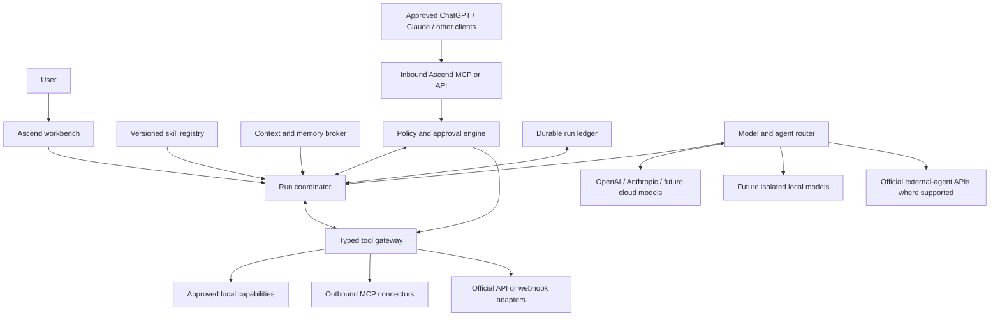

# Agent OS and Skills Architecture Proposal

**Status:** Proposed on 2026-07-19 under OD-19; founder approval required
**Scope:** Long-term architecture and vocabulary only
**Implementation authority:** None. This proposal does not authorize an agent runtime, skill loader, autonomous workflow, provider SDK, credential, cloud resource, external-AI trigger, browser automation, real data, dependency, spending, distribution, or deployment.

## Objective

Ascend should grow from a dependable individual productivity application into a trusted personal agent and, later, an organization-ready Agent OS. It may become the user's main interface for understanding work, choosing an AI model, applying reusable skills, coordinating approved tools, and completing bounded actions across local and connected systems.

“Single interface” means the user can begin and supervise work in Ascend without having to understand which model, skill, connector, or specialist performed each step. It does **not** mean one omnipotent model, one permanently privileged process, or hidden remote control of consumer applications.

Ascend must own the durable product layer:

- Identity, tenant, workspace, membership, and data ownership
- Permissions, policy, risk classification, and human approvals
- Personal and deliberately shared memory
- Skill and tool catalogs
- Durable run state, checkpoints, budgets, and cancellation
- Execution receipts, verification, and audit history
- Provider routing and local/cloud disclosure
- The final user experience

OpenAI, Anthropic, future cloud providers, local models, and external agents are replaceable intelligence or execution providers. They do not own Ascend authorization.

## Product direction

The long-term product can support four compatible experiences:

1. **Personal copilot:** answer, summarize, plan, recall, and prepare work from the user's approved private context.
2. **Bounded agent:** execute typed, reviewable operations through least-privilege tools and connectors.
3. **Agent workspace:** run durable personal or team workflows with progress, checkpoints, evidence, and recovery.
4. **Agent OS:** coordinate local capabilities, cloud models, external services, approved external agents, and later specialist agents behind one policy and memory layer.

The individual release remains the first priority. Team and organization support later adds catalogs, workspace policies, shared workflows, and administration without making personal runs, skills, or memory organization-visible by default.

## Current-source findings

The following official patterns inform the proposal. They are product evidence, not dependencies or implementation approval.

### Reusable skills are versioned context, not magic permissions

- [ClickUp AI Skills](https://help.clickup.com/hc/en-us/articles/41776686173335-What-are-AI-Skills) are reusable playbooks containing steps, context, and style. ClickUp separates creation, status, ownership, sharing, installation, and version history.
- [ClickUp's Brain usage model](https://help.clickup.com/hc/en-us/articles/41776839153559-Use-AI-Skills-in-Brain) distinguishes automatically available installed skills from explicit invocation and keeps skills private until deliberately shared.
- [OpenAI Skills](https://developers.openai.com/api/docs/guides/tools-skills) are versioned bundles with a manifest and supporting resources. Their instructions can be loaded progressively, and OpenAI explicitly warns that skills can contain prompt-injection or data-exfiltration risk.
- [ChatGPT Skills and Plugins](https://learn.chatgpt.com/docs/skills-and-plugins) distinguish reusable workflows from packages that may also include connectors or MCP servers.
- [Anthropic Agent Skills](https://platform.claude.com/docs/en/agents-and-tools/agent-skills/overview) similarly package instructions, metadata, and optional scripts or templates for on-demand use.

Ascend should adopt the useful portability and progressive-loading pattern while keeping permissions outside the skill bundle.

### Models propose tool calls; the application executes them

[Anthropic's tool-use contract](https://platform.claude.com/docs/en/agents-and-tools/tool-use/how-tool-use-works) states the clean boundary directly: the model emits a structured request and the application executes client tools. [OpenAI's MCP and connector guidance](https://developers.openai.com/api/docs/guides/tools-connectors-mcp) likewise treats remote tools as a separate, approval-sensitive boundary and warns that untrusted servers can exfiltrate context.

Therefore, Ascend must never parse ordinary prose into privileged execution. A provider returns a typed proposal. Ascend validates, authorizes, previews, executes, verifies, and records the operation.

### MCP is interoperability, not Ascend's authorization system

MCP can let Ascend consume external tools and can let approved ChatGPT, Claude, Codex, or other clients consume Ascend tools. It does not replace tenant, workspace, data-class, risk, or user-consent checks.

The [MCP authorization specification](https://modelcontextprotocol.io/specification/2025-11-25/basic/authorization) requires resource-bound authorization behavior, while the [official authorization tutorial](https://modelcontextprotocol.io/docs/tutorials/security/authorization) recommends least-privilege scopes, encrypted token storage, HTTPS, issuer and audience validation, redacted logs, and protection against cross-tenant mix-ups. Ascend applies those controls in addition to operation-level product policy.

### Start with one responsible agent

[OpenAI's orchestration guidance](https://developers.openai.com/api/docs/guides/agents/orchestration) distinguishes handoffs from manager-controlled “agents as tools” and recommends adding multiple agents only when specialization or isolation justifies the complexity. Ascend should begin with one responsible coordinator and bounded specialists, not an uncontrolled swarm.

### Human approval is durable run state

[OpenAI's guardrail and human-review guidance](https://developers.openai.com/api/docs/guides/agents/guardrails-approvals) models approval as a pause before side effects and a resumable part of the same run. Ascend should bind an approval to the exact proposed operation and invalidate it if the arguments, target, actor, policy, or run changes.

## Required vocabulary

These terms are distinct in storage, APIs, UI, policy, and audit records.

| Term                        | Ascend meaning                                                                                                                              | What it never grants by itself                                         |
| --------------------------- | ------------------------------------------------------------------------------------------------------------------------------------------- | ---------------------------------------------------------------------- |
| **Model provider**          | An inference service or local runtime that proposes text, plans, structured outputs, or tool calls                                          | Permission to read data or execute tools                               |
| **External agent provider** | An officially supported service that can run a separately configured agent through a documented API                                         | Access to Ascend memory, credentials, or tools beyond the run grant    |
| **Agent profile**           | A versioned configuration selecting instructions, model policy, allowed skill references, tool policy, budgets, and output contract         | Permanent authority or a user identity                                 |
| **Skill**                   | A versioned, reviewable bundle of reusable instructions and resources, with optional isolated scripts only after a future security approval | Credentials, scopes, data access, tool access, or automatic execution  |
| **Tool**                    | One typed, bounded operation such as `calendar.events.list` or `task.comment.create`                                                        | Broader provider access than its schema and grant allow                |
| **Connector**               | An authenticated adapter to an external or local system, backed by MCP or an official API                                                   | Product authorization merely because the provider exposes a capability |
| **Workflow**                | A deterministic or policy-constrained graph of steps, checkpoints, and failure paths                                                        | Authority to skip approvals or invent new steps                        |
| **Trigger**                 | A manual request, schedule, or approved event that proposes starting a run                                                                  | Tool or data permission                                                |
| **Run**                     | One durable execution with actor, workspace, policy snapshot, inputs, plan, calls, approvals, outputs, and terminal state                   | Authority outside its scoped grants and lifetime                       |
| **Memory item**             | Source-linked context with ownership, workspace, data class, provenance, confidence, and retention                                          | Instruction priority or permission because its content says so         |
| **Policy grant**            | Code-enforced permission for an actor or service principal to perform defined operations in a defined scope                                 | More authority than its exact subject, target, operations, and expiry  |
| **Approval**                | A human decision over an exact risk-classified proposal                                                                                     | Reuse for modified arguments, another run, or a different target       |
| **Execution receipt**       | Tamper-evident evidence of what actually ran, where, with which policy and result                                                           | Proof that the result was correct without separate verification        |

Using “skill,” “tool,” “agent,” “connector,” or “workflow” interchangeably is prohibited because doing so hides security and lifecycle boundaries.

## Logical architecture



The model and agent router selects intelligence. The tool gateway owns execution. The context broker owns disclosure. The policy engine owns authority. The run ledger owns durable truth. No provider combines those roles merely because its SDK offers convenient abstractions.

## Core components

### 1. Ascend workbench

The workbench is the user's single control surface for chat, tasks, skill choice, plan preview, progress, approvals, sources, results, errors, and cancellation. It always shows whether work is local, cloud, or mixed and whether Ascend or an external agent is currently responsible.

### 2. Run coordinator

The coordinator converts an approved request into a durable run. It does not hold provider credentials and does not execute arbitrary model-produced code. It advances only through valid state transitions, enforces budgets and deadlines, and resumes from checkpoints without repeating confirmed side effects.

### 3. Skill registry

The registry stores reviewed skill metadata and immutable versions. It supports personal, workspace, and later organization-owned skills while keeping sharing, installation, activation, and invocation separate.

### 4. Context and memory broker

The broker assembles the minimum context permitted for the run. It evaluates tenant, workspace, ownership, data class, purpose, provider disclosure, retention policy, and token budget before material reaches a model, skill, tool, or external agent. OD-20's future raw screenshots are a restricted local-only data class and are not included merely because derived visual context exists; any image-bearing run requires its own approved local-only disclosure policy.

### 5. Policy and approval engine

The policy engine is deterministic application code below the UI. It evaluates the actor, membership, workspace, trigger mode, data class, connector grant, tool operation, risk tier, destination, and current policy version. It can deny, allow, require preview, or pause for approval.

### 6. Model and external-agent router

The router chooses among approved cloud models, future local models, and documented external-agent surfaces. Routing follows capability, privacy/locality, cost, latency, reliability, and user policy. A provider outage cannot silently weaken locality or permission policy.

### 7. Typed tool gateway

All local and external side effects pass through one gateway. It validates a versioned schema, canonicalizes targets, enforces policy, applies idempotency, invokes an allowlisted adapter, validates the result, performs read-after-write verification where possible, and emits an execution receipt.

### 8. Durable run ledger

The ledger records intent, normalized inputs, actor and workspace, selected versions, policy snapshot, context disclosures, tool proposals, approvals, provider calls, receipts, verification, errors, costs, cancellation, and terminal status. Sensitive content is referenced or redacted according to its data class; an audit log is not an excuse to duplicate secrets or private content.

### 9. Scheduler and event inbox

Schedules, calendar events, provider webhooks, and local signals enter an inert event inbox. They may suggest a run but cannot execute tools directly. Deduplication, occurrence identity, freshness, quiet hours, and per-trigger policies apply before a run begins.

### 10. Evaluation and observability

Agent behavior needs traceable quality measures: task success, source correctness, unsafe-call denial, approval quality, duplicated writes, recovery, latency, cost, and user correction. Diagnostics use allowlisted metadata and must not silently upload prompts, memory, credentials, transcripts, or health data.

## Skill architecture

### Skill package

A future Ascend skill version should have an immutable manifest containing at least:

- Stable skill ID, version, name, description, and owner
- Visibility: personal, explicitly shared, workspace-owned, or organization-owned
- Lifecycle status: draft, under review, active, deprecated, revoked
- Author and provenance, content hash, optional publisher signature, and review record
- Instruction entry point and allowlisted resources
- Declared input and output schema
- Required tool capabilities and data classes as **requests**, not grants
- Supported trigger modes and whether background execution is prohibited
- Network, filesystem, script, and model requirements
- Dependency references with version constraints and recursion limits
- Risk notes, failure modes, tests, evaluation cases, and compatibility range

The runtime loads only catalog metadata for discovery, then the selected manifest and instructions, then only the specific resources required. This progressive-disclosure model limits context size and reduces accidental exposure.

### Skill lifecycle and ownership

The lifecycle is:

```text
draft -> review -> active -> deprecated -> revoked
```

- A personal skill is private by default.
- Sharing makes a version discoverable to selected people or workspaces; it does not install it.
- Installing accepts a reviewed version into a catalog; it does not activate automatic use.
- Activating permits selection under policy; it does not grant tools or data.
- Invoking starts a run under the current actor, workspace, grants, and risk policy.
- Upgrades create a new immutable version and require review when instructions, resources, scripts, required tools, or data classes change.
- Revocation blocks new runs and defines how paused or scheduled runs are handled.

Organization administrators may govern an organization catalog and approved connector policies later. That role does not grant access to a member's personal skills, memory, or run history.

### Skill execution safety

Skill text, templates, files, examples, and scripts are untrusted supply-chain inputs. A skill cannot:

- Grant itself or another skill a permission
- Read credentials or raw connector tokens
- Expand its tool allowlist through prompt text
- Change tenant, workspace, owner, or data class
- Install dependencies or download executable content silently
- Invoke unrestricted shell, SQL, filesystem, browser, or device control
- Mark its own result verified
- Disable audit, budgets, approvals, or cancellation
- Recursively invoke skills without explicit depth and budget limits

Built-in, reviewed, instruction-only skills should come first. Any script-capable or third-party skill ecosystem requires a later sandbox, signing, distribution, update, revocation, vulnerability-response, and incident-response specification.

## Authority model

Effective authority is the intersection of all relevant controls, never their union:

```text
actor and membership permission
AND tenant/workspace scope
AND data-class and purpose policy
AND connector grant and provider scopes
AND tool operation allowlist
AND agent-profile policy
AND trigger-mode policy
AND current risk/approval decision
AND run lifetime and budget
```

If any element denies an operation, the operation is denied. A model, skill, provider tool description, MCP server, imported document, administrator message, or retrieved webpage cannot add authority through instructions.

## Risk and approval tiers

The exact defaults require feature-specific approval, but the architecture reserves these tiers:

| Tier                                      | Example                                                                             | Foundation posture                                                                                   |
| ----------------------------------------- | ----------------------------------------------------------------------------------- | ---------------------------------------------------------------------------------------------------- |
| **0 — reasoning**                         | Summarize already permitted context                                                 | No side effect; still bounded and recorded                                                           |
| **1 — read or private draft**             | Read assigned tasks; prepare a local draft                                          | Allow only under explicit data and connector grants                                                  |
| **2 — reversible external write**         | Add a task comment or create a calendar draft                                       | Exact preview and explicit approval initially                                                        |
| **3 — destructive or high-impact action** | Delete, send, purchase, change permissions, control a device                        | Strong confirmation, fresh authentication where appropriate, narrow execution, and recovery evidence |
| **4 — prohibited**                        | Exfiltrate credentials, bypass controls, hidden surveillance, self-expand authority | Never execute                                                                                        |

Background and scheduled runs use stricter policy than interactive runs. Silence is never consent. Organization policy may reduce authority but cannot silently expose or broaden a member's personal data.

### Approval binding

An approval is valid only for the recorded:

- Actor or authorized service principal
- Tenant and workspace
- Run and step
- Tool and schema version
- Canonical target and exact arguments or human-readable diff
- Data disclosed and destination
- Risk tier, policy version, cost ceiling, and expiry

Changing any bound field invalidates the approval. “Approve all future actions” is not an acceptable default for external writes, destructive actions, identity/permission changes, financial actions, private-data export, recording, or device control.

## Typed execution contract

The first implementation slice should define provider-neutral equivalents of:

- `AgentRunRequest`
- `AgentRunPlan`
- `ModelTurnRequest` and `ModelTurnResult`
- `ToolCallProposal`
- `ApprovalRequest` and `ApprovalDecision`
- `ToolExecutionRequest`
- `ExecutionReceipt`
- `AgentRunResult`

These names are conceptual until separately specified. Every tool uses a narrow schema and stable operation ID. Free-form model prose is never converted to SQL, shell commands, URLs, filesystem paths, permission changes, or provider writes without typed normalization and validation.

## Durable run and recovery model

The minimum run state machine is:

```text
draft
  -> planned
  -> awaiting_approval
  -> running
  -> paused
  -> completed | degraded | failed | cancelled
```

A run records a monotonic step sequence. Each side-effecting step has an idempotency key, precondition snapshot, attempt record, provider correlation ID, result, verification state, and compensation or recovery instruction where practical.

After a crash or restart, Ascend reconciles uncertain operations before retrying them. It never assumes that a timeout means the provider did nothing. Reads may be repeated under budget; writes require idempotency or explicit reconciliation.

## Context, memory, and prompt-injection boundary

Every context item carries source, owner, tenant, workspace, data class, trust label, fetched time, retention policy, and provenance. Retrieved content is evidence, not instruction authority.

The broker separates:

- System and product policy
- User intent
- Reviewed skill instructions
- Tool schemas
- Trusted structured state
- Untrusted provider, document, webpage, email, task, calendar, transcript, future screenshot/visual observation, and model content

Untrusted content can inform an answer but cannot change policy, reveal unrelated context, select hidden tools, approve an action, or rewrite an audit record. Cross-provider handoffs receive the minimum allowlisted context, not the full conversation or memory by default. Raw screenshots never enter a cloud-model or external-agent handoff through a generic memory grant; a future local-only vision run and a later disclosure of approved derived text are separate decisions with separate receipts.

## Relationship with ChatGPT and Claude

Ascend should support three official, separable directions:

### 1. Ascend uses models through provider APIs

Ascend may use OpenAI, Anthropic, future providers, or approved local models behind its own workbench and policy layer. This is the primary route for a consistent single-interface product. The user chooses or accepts a routing policy; Ascend still owns context selection, tools, approvals, and run state.

### 2. ChatGPT, Claude, or another client uses Ascend tools

Ascend may expose a scoped MCP/API surface so an approved external AI client can read permitted Ascend context or propose an inbox item. This is an inbound client relationship and remains separate from Ascend's outbound provider connectors.

### 3. Ascend invokes a documented external-agent API

Where a provider publishes a stable agent-run API, Ascend may treat it as an `external_agent_provider`. For example, OpenAI currently documents a [Workspace Agent trigger endpoint](https://developers.openai.com/workspace-agents/trigger-runs). Such a route still receives a minimal run grant, disclosure record, timeout, budget, and result validation. It never inherits the user's entire Ascend session.

Current official surfaces do not justify making browser/UI automation, consumer-session cookies, private endpoints, or reverse-engineered control of arbitrary existing ChatGPT or Claude chats a foundation. That would be brittle, difficult to audit, and unsafe for credentials. If a future official surface supports a useful operation, its provider profile can be added without changing the Agent OS boundary.

## Multi-agent evolution

Ascend should use the smallest orchestration that solves the task:

1. One coordinator with bounded skills and tools
2. Specialist agents invoked as typed tools while the coordinator remains responsible
3. Explicit handoff only when the specialist genuinely needs its own user-facing thread or policy context
4. Parallel specialists only when budgets, cancellation, conflicting writes, result merging, and traceability are proven

Specialists receive narrow context, tools, time, cost, depth, and output contracts. They cannot create new agents, install skills, or delegate recursively unless a future policy explicitly permits it within hard limits.

## Organization-ready behavior

The Agent OS must preserve the project's individual-first privacy rule:

- Personal agents, runs, skills, schedules, connector grants, and memory are private by default.
- Workspace or organization skills have explicit owners, publishers, installers, versions, and visibility.
- Organization policy can restrict models, tools, retention, destinations, costs, and skill catalogs for organization-owned work.
- Organization policy does not make personal memory or run history visible to administrators.
- Shared workflows use organization service principals only where explicitly specified; they never impersonate a member.
- Every action records the human or service actor, membership, workspace, triggering source, and approval authority.
- Departing members retain personal data and lose organization-owned authority according to an approved offboarding policy.
- Health, wellbeing, voice identity, energy, and spiritual modules never inherit a work agent's tools or organization grants.

## Threats that must be designed out

| Threat                                              | Mandatory architectural response                                                                                           |
| --------------------------------------------------- | -------------------------------------------------------------------------------------------------------------------------- |
| Malicious skill or update                           | Immutable versions, provenance, review, hashes/signatures where applicable, no implicit upgrade, immediate revocation      |
| Prompt injection from connected data                | Trust labels, context separation, typed tools, policy outside prompts, destination-aware disclosure                        |
| Model invents or alters a tool call                 | Strict schema, canonicalization, exact preview, policy check, no prose execution                                           |
| Confused deputy across people or workspaces         | Explicit actor, tenant, workspace, membership, connector, and target on every run and tool call                            |
| Approval laundering                                 | Approval bound to exact operation; edits invalidate it; imported text cannot approve                                       |
| Duplicate write after retry or crash                | Idempotency, provider correlation, reconciliation, read-after-write verification                                           |
| External agent receives excessive context           | Minimum disclosure plan, provider/data-class policy, receipt, retention notice, redaction                                  |
| Skill recursion or agent swarm consumes resources   | Depth, concurrency, token, time, cost, network, and tool-call budgets with cancellation                                    |
| Provider outage weakens privacy                     | Fail closed or request a visible route change; never silently switch local to cloud                                        |
| MCP or connector token crosses boundaries           | Separate stores and audiences; no token passthrough; exact issuer, audience, actor, workspace, and environment binding     |
| Organization policy exposes personal data           | Separate personal/workspace ownership and deny-by-default cross-boundary tests                                             |
| Browser automation captures credentials or wrong UI | Not a foundation route; require a later separately approved, user-visible, least-privilege specification if ever justified |

## Build now versus build later

### Preserve now in architecture and planning

- The distinct nouns and authority boundaries in this proposal
- Actor, tenant, workspace, data-class, purpose, and provenance on future run/tool contracts
- Separation of model selection, skill content, context disclosure, policy, execution, and durable run state
- No direct model-to-side-effect path
- No assumption that one cloud provider owns memory or workflow state
- Personal versus workspace/organization ownership from the first relevant schema
- A reserved decision gate for any agentic implementation

### Do not build during Milestone 0

- Agent runtime or orchestration framework
- Skill loader, Skills Hub, marketplace, or third-party skill execution
- Autonomous schedules or background agents
- External ChatGPT/Claude agent control
- Provider model SDK or local model runtime
- Connector credentials, cloud resources, or provider app registrations
- Tool-write path, broad device control, browser automation, or computer-use agent
- New speculative agent/skill/run database tables in migration 0001

Concrete tables and interfaces should be introduced only with the first approved agentic vertical slice. This avoids both direct coupling and an unused framework.

## Recommended first agentic vertical slice

After Milestone 0, OD-18 and OD-19 approval, the relevant integration gates, and a separately approved feature specification, the safest proving slice is a **Daily Work Brief**:

- User starts it manually.
- It reads only the user's permitted local work memory, upcoming Google Calendar events, and assigned ClickUp/Asana tasks.
- It does not read raw screenshots or invoke a screen-capture/vision capability.
- One reviewed built-in instruction-only skill shapes the brief.
- One selected model produces a source-linked draft.
- No task, calendar, email, message, file, or memory record is changed.
- The run records context disclosures, provider/model route, sources, cost/latency, and result status.

This slice validates the skill registry, context broker, model router, read-only tool gateway, durable run ledger, and source receipts without introducing external side effects or autonomous execution.

## Acceptance criteria for this architecture

- Skills, tools, connectors, models, external agents, workflows, triggers, runs, grants, approvals, and receipts have separate definitions.
- Ascend—not a prompt or provider—owns identity, policy, memory, execution, and audit.
- Skills cannot grant authority or obtain credentials.
- Model output cannot execute directly.
- External writes and high-impact actions are typed, risk-classified, previewed, approval-gated, idempotent, verified, and audited.
- The run model can pause, resume, reconcile uncertain outcomes, cancel, and recover without duplicating writes.
- ChatGPT/Claude API use, inbound Ascend MCP access, and official external-agent invocation are separate provider relationships.
- Browser/session automation is not a foundational control path.
- Personal, workspace, and organization skill/run ownership is explicit and private by default.
- Local/cloud route, context disclosure, model/provider, skill/tool versions, approvals, and execution outcomes are visible and recorded.
- No agent runtime, skill loader, dependency, provider account, credential, cloud resource, real data, or speculative schema is created through approval of this document.

## Follow-up sequence after approval

1. Preserve OD-19 and ADR-0005 as design constraints while finishing the current Milestone 0 sequence.
2. Do not add agent tables to migration 0001 unless the approved data-model specification proves a minimum stable identity or audit seam is required.
3. After Milestone 0, select and specify the read-only Daily Work Brief as a candidate first agentic slice.
4. Re-verify current provider SDKs, retention, pricing, MCP maturity, and external-agent APIs at implementation time.
5. Define exact typed contracts, run persistence, data disclosures, risk policy, evaluation cases, and failure recovery in that feature specification.
6. Use TDD: first prove denied authority, cross-workspace isolation, prompt-injection resistance, bounded execution, and read-only behavior; then add the minimum implementation.
7. Consider external writes, background triggers, specialist agents, script-capable skills, or organization catalogs only through separate approved slices.

## Approval requested

Approve the Agent OS direction and its security boundaries without authorizing implementation.

Use this exact text:

> Approved: AGENT-OS-AND-SKILLS-ARCHITECTURE-PROPOSAL. Adopt OD-19 and ADR-0005. Treat Ascend as the trusted agent and single-interface layer; keep models, external agents, skills, tools, connectors, memory, permissions, approvals, and run state separate. Skills never grant authority, model output never executes directly, and external side effects remain typed, policy-checked, previewed, approval-gated, idempotent, verified, and audited. Do not implement an agent runtime, skill loader, autonomous workflow, external ChatGPT/Claude control, dependency, credential, cloud resource, real data, or browser/session automation through this approval.
