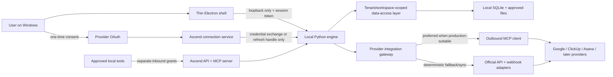

# Ascend Approved Architecture

**Status:** Approved logical architecture as of 2026-07-18
**Version scope:** Individual Windows v1 with organization-ready foundations
**Runtime versions:** Selected separately in `docs/STACK-VERSION-PROPOSAL.md`; installation remains approval-gated

## Purpose

This document is the compact source of truth for how Ascend's major parts fit together. Product requirements remain in `docs/SPEC.md`; detailed provider behavior remains in `docs/INTEGRATIONS-SPEC.md`; security abuse cases remain in `docs/THREAT-MODEL.md`; accepted rationale remains in the ADRs.

Ascend starts as a private productivity product for one person. Its ownership and authorization model is deliberately shaped so that a personal tenant can later coexist with 20-person startups, 100-person companies, or 500-person organizations without replacing identity, workspace, membership, permission, or audit foundations.

## System shape



The diagram shows logical flows, not an authorization shortcut. The desktop must never receive a reusable provider client secret. Provider content must not pass through the connection service by default. Inbound grants used by ChatGPT, Claude, or another approved client cannot be reused for Ascend's outbound provider access.

## Components and responsibilities

### 1. Electron shell

The shell owns tray behavior, visible windows and overlays, global shortcuts, user-facing permission prompts, and supervision of the local engine. It stays thin: business rules, provider normalization, memory, capture behavior, and database access do not move into renderer code.

The renderer is sandboxed, has no Node.js integration, receives only narrow typed preload functions, and cannot call arbitrary IPC channels. Every privileged IPC handler validates the sender and input.

### 2. Python engine

The hidden engine owns product behavior, capture orchestration, transcription adapters, productivity calculations, work memory, integration normalization, the local API/MCP surface, and lifecycle-aware access to local persistence.

It binds only to loopback on an ephemeral port, requires a fresh per-session capability token, exposes a minimal readiness contract, and shuts down under shell supervision. A random open port without the expected token is never treated as Ascend.

### 3. Local data boundary

Exactly one data-access layer owns SQLite. Repositories require actor, tenant, and workspace context. Direct database opens outside that layer are prohibited and checked structurally.

Migration 0001 will create a stable local actor, personal tenant, personal workspace, owner membership, and device. A tenant is an Ascend account and authorization boundary. A client/company or project mentioned in work memory is a work entity and must use different types, IDs, repositories, and tests.

No real activity, meeting audio, transcript, memory, or other sensitive user data may be stored until OD-03 selects and proves the at-rest posture. Synthetic development data may use ordinary SQLite only within that gate.

### 4. Provider integration gateway

Ascend uses one provider-neutral contract and provider profiles. Each profile records its preferred route, API fallback, OAuth/scopes, supported capabilities, schema version, rate-limit behavior, freshness state, and audit fields.

- MCP is preferred when the provider's official remote MCP service is production-suitable.
- Official API and webhook adapters remain available for deterministic synchronization, pagination, recovery, or missing MCP capabilities.
- Canonical Ascend models isolate product code from provider payloads and tool schemas.
- Unknown or changed tools and schemas fail closed; they do not silently broaden access.
- Initial v1 provider operations are read-only even if a provider advertises write tools.

Initial routing is Google Calendar through its stable API, ClickUp and Asana through official MCP where suitable with API fallback, and Outlook Calendar later through Microsoft Graph until its MCP route is production-ready. Slack is a later provider.

### 5. OAuth and connection service

Ascend creates one provider app registration per provider and environment where required. Each user sees the provider's own consent screen once and grants access to their own provider account. For the user, the normal experience is Connect, provider sign-in/consent, and return to Ascend.

Reusable client secrets and confidential OAuth exchange/refresh stay in a separately approved backend connection service or provider-approved confidential boundary. User grants are isolated by actor, tenant, workspace, provider account, provider application, and environment. Revocation must stop future access promptly.

The exact hosting, callback domains, secrets store, logging/redaction, availability, abuse controls, cost envelope, and incident response remain gated by OD-13. No cloud resource or provider app has been authorized yet.

### 6. Ascend API and MCP server

Ascend's inbound API/MCP surface is distinct from its outbound provider connections. Approved clients receive explicit local grants and least-privilege scopes. Read operations may return permitted memory and aggregates. Suggested additions enter a reviewable inbox rather than mutating trusted memory directly.

No public network listener, implicit localhost trust, shared bearer credential, or inbound-to-outbound credential reuse is allowed.

### 7. Future organization layer

The individual release creates seams, not team features. Invitations, shared workspaces, cloud synchronization, role administration, billing, SSO, SCIM, retention, legal hold, and organization analytics remain outside v1 and require separate specifications.

When team work begins, membership—not identity alone—will carry role and permissions. Personal capture remains private unless deliberately shared. Every organization-owned operation will be tenant- and workspace-scoped and audited.

## Architectural invariants

1. The Python engine is the sole owner of SQLite and local product behavior.
2. The Electron renderer is untrusted relative to privileged shell and engine operations.
3. Shell/engine traffic is loopback-only, session-authenticated, schema-validated, and supervised.
4. Actor, tenant, workspace, membership, permission, ownership, and audit context exist before product data.
5. Tenant accounts and client/company work entities never share an ID or authorization meaning.
6. Provider access is personal, selected, revocable, source-linked, freshness-aware, and least-privilege.
7. MCP-first never means MCP-only; official API/webhook fallback remains contract-tested.
8. Inbound Ascend grants and outbound provider credentials are separate trust domains.
9. Reusable provider client secrets never ship in the desktop application.
10. Initial v1 denies provider writes. A future write requires typed validation, exact preview, explicit confirmation, idempotent execution, verification, and audit.
11. Provider content does not traverse the connection service by default.
12. Sensitive storage, live credentials, provider provisioning, signing spend, deployment, and production changes remain separately approval-gated.

## Future provider-write pipeline

Provider writes are not part of initial v1. If later approved, every write follows this sequence:

```text
typed request
    -> authorization and capability check
    -> exact user-visible preview
    -> explicit confirmation
    -> idempotent provider execution
    -> read-after-write verification
    -> tamper-evident audit record
```

Destructive or high-impact operations require stronger confirmation and recovery rules. A provider MCP server advertising a write tool does not make that tool reachable automatically.

## Decision and approval map

| Area                                                          | State                               | Record                           |
| ------------------------------------------------------------- | ----------------------------------- | -------------------------------- |
| Individual-first, organization-ready identity/workspace model | Approved                            | ADR-0001                         |
| Initial Google Calendar, ClickUp, and Asana scope             | Approved                            | ADR-0002                         |
| MCP-first/API-fallback gateway and OAuth boundary             | Approved                            | ADR-0003                         |
| Exact runtime and tool versions                               | Proposal awaiting approval          | `docs/STACK-VERSION-PROPOSAL.md` |
| At-rest database and recording protection                     | Open; blocks migration/real data    | OD-03                            |
| Historical credential rotation                                | Open; blocks live provider tests    | OD-04                            |
| Connection service/provider app provisioning                  | Open; blocks cloud/live credentials | OD-13                            |

## Change rule

Any change that moves a trust boundary, adds a provider write, introduces cloud persistence, changes tenant/workspace ownership, gives the renderer new privilege, or embeds a confidential credential requires a specification update, threat-model update, and new or amended ADR before implementation.
