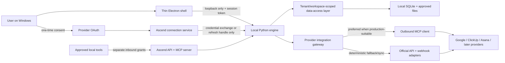

# Ascend Approved Architecture

**Status:** Approved core logical architecture; OD-18 capability/runtime and OD-19 Agent OS extensions proposed on 2026-07-19
**Version scope:** Individual Windows v1 with organization-ready foundations
**Runtime versions:** Approved and installed task-by-task through `docs/STACK-VERSION-PROPOSAL.md`

## Purpose

This document is the compact source of truth for how Ascend's major parts fit together. Product requirements remain in `docs/SPEC.md`; detailed provider behavior remains in `docs/INTEGRATIONS-SPEC.md`; security abuse cases remain in `docs/THREAT-MODEL.md`; accepted rationale remains in the ADRs.

Ascend starts as a private context, memory, and work-productivity product for one person. Its ownership and authorization model is deliberately shaped so that a personal tenant can later coexist with 20-person startups, 100-person companies, or 500-person organizations without replacing identity, workspace, membership, permission, or audit foundations. Its capability and data-class seams are also intended to support optional future personal modules across work, mind, body, energy, and spiritual wellbeing without exposing those private domains to an organization. OD-19 separately proposes Ascend as the trusted Agent OS layer that can coordinate replaceable models, skills, tools, connectors, and external agents without giving prompt content or providers authority over Ascend data and actions.

## System shape


```mermaid
flowchart LR
    U["User on Windows"] --> S["Thin Electron shell"]
    S -->|"loopback only + session token"| E["Local Python engine"]
    E --> D["Tenant/workspace-scoped data-access layer"]
    D --> L["Local SQLite + approved files"]

    E --> G["Provider integration gateway"]
    G -->|"preferred when production-suitable"| MC["Outbound MCP client"]
    G -->|"deterministic fallback/sync"| AP["Official API + webhook adapters"]
    MC --> P["Google / ClickUp / Asana / later providers"]
    AP --> P

    U -->|"one-time consent"| OA["Provider OAuth"]
    OA --> C["Ascend connection service"]
    C -->|"credential exchange or refresh handle only"| E

    T["Approved local tools"] -->|"separate inbound grants"| IA["Ascend API + MCP server"]
    IA --> E
```

The diagram shows logical flows, not an authorization shortcut. The desktop must never receive a reusable provider client secret. Provider content must not pass through the connection service by default. Inbound grants used by ChatGPT, Claude, or another approved client cannot be reused for Ascend's outbound provider access.

## Components and responsibilities

### 1. Electron shell

The shell owns tray behavior, visible windows and overlays, global shortcuts, user-facing permission prompts, and supervision of the local engine. It stays thin: business rules, provider normalization, memory, capture behavior, and database access do not move into renderer code.

The renderer is sandboxed, has no Node.js integration, receives only narrow typed preload functions, and cannot call arbitrary IPC channels. Every privileged IPC handler validates the sender and input.

### 2. Python engine

The hidden engine owns product behavior, capture orchestration, transcription adapters, productivity calculations, work memory, integration normalization, the local API/MCP surface, and lifecycle-aware access to local persistence.

It binds only to loopback on an ephemeral port, requires a fresh per-session capability token, exposes a minimal readiness contract, and shuts down under shell supervision. A random open port without the expected token is never treated as Ascend.

### 2A. Windows hardware boundary

The engine owns one hardware/capture arbiter and provider-neutral typed contracts across dictation, microphone tests, meeting capture, and future approved capture. A narrow Windows adapter owns Core Audio endpoint enumeration, persistent device notifications, microphone capture, render-endpoint mute, read-back verification, and crash-safe restoration. Native callbacks enqueue nonblocking events onto one serialized worker; Windows COM objects and pointers never cross into the renderer or general domain code.

The Electron main process owns display topology, window placement, overlays, global shortcuts, user-facing capability prompts, and supervision. It refreshes the complete display snapshot when displays are added, removed, rotated, rescaled, or repositioned. Geometry remains in device-independent pixels and supports negative coordinates and mixed DPI.

The baseline behavior was approved as OD-17 in `docs/WINDOWS-HARDWARE-BASELINE-PROPOSAL.md`. The approval defines behavior and sequencing only; no native dependency or toolchain is selected by the logical architecture alone.

### 2B. Proposed capability and inference boundary

OD-18 proposes versioned capability contracts between product modules and concrete cloud services, local models, hardware backends, and capture sources. Domain modules own product meaning, authorization, data classification, and user-visible policy. Adapters own implementation-specific translation and return a structured result plus an execution receipt containing the actual adapter, runtime/model or service, locality route, device/backend class, timing, and typed failure state.

Dependency-heavy, native, model, CUDA, DirectML, Windows ML, GPU, or NPU work runs in supervised resource-bounded workers. Workers receive narrow inputs and temporary artifact handles; they never open SQLite, read the credential store, expose MCP, or gain unrelated tenant/workspace filesystem access. The trusted engine validates requests/results and persists approved records through the single data-access layer.

Local/cloud routing is explicit policy, never an invisible fallback. Model and runtime artifacts are pinned, hash-verified, license-recorded, quarantined before activation, rollback-capable, and denied arbitrary remote code. A resource governor controls RAM, disk, CPU, GPU/NPU memory, battery, thermal pressure, queueing, and concurrency; real-time capture takes priority over background inference.

This section is a proposed boundary, not implementation authorization. `docs/FUTURE-CAPABILITY-ARCHITECTURE-PROPOSAL.md` and proposed ADR-0004 define the full contract and retained gates.

#### Future local visual-context seam

OD-20 preserves a future, separately specified visual-context capability without adding it to v1. The capability keeps three capture modes distinct: accessibility/window metadata, a transient frame used only for local OCR, and an explicitly retained screenshot. Retained screenshots are user-controlled personal assets, off by default, encrypted before real use, bounded by target/cadence/retention policy, and local-only. There is no implicit cloud-vision fallback.

An approved Windows capture adapter may provide a brokered frame or encrypted asset handle to an isolated local vision/OCR worker. The worker has no direct SQLite, credential-store, MCP, unrelated filesystem, or network authority. The trusted engine validates the worker result, records capture and model provenance, and alone decides whether a derived observation may enter scoped memory. Raw screenshots and derived visual context are separate data classes; neither becomes organization-visible or generally available through API, MCP, export, search, diagnostics, or unrelated AI context by default.

The exact Windows API, capture cadence, target selection, retention default, encryption format, vision model/runtime, supported hardware, and deletion behavior remain feature-specification decisions. Current Microsoft documentation makes `Windows.Graphics.Capture` and Windows-local imaging capabilities plausible candidates, but package, consent, hardware, and support constraints must be re-verified before selection. This seam authorizes no capture, model, dependency, schema, real data, or distribution.

### 2C. Proposed Agent OS and skills boundary

OD-19 proposes an application-owned agent layer above model and capability adapters. Ascend owns identity, workspace scope, context disclosure, policy, approvals, typed execution, durable run state, verification, and audit. Cloud models, future local models, and documented external-agent APIs remain replaceable providers. They receive only the context and operations permitted for one run and never receive raw connector credentials.

A skill is a versioned, reviewable instruction/resource bundle, not a permission-bearing plugin. Sharing, installation, activation, and invocation are distinct. A skill can request capabilities, but effective authority remains the intersection of actor/membership permission, tenant/workspace, data class and purpose, connector grant, tool allowlist, agent profile, trigger mode, current approval, lifetime, and budget.

Model output is an untrusted proposal. Every side effect passes through a typed tool gateway that validates a versioned schema and canonical target, evaluates policy, produces an exact preview when required, binds approval, applies idempotency, invokes one allowlisted adapter, validates and verifies the result, and writes an execution receipt. Durable runs pause and resume without blindly repeating uncertain writes.

Ascend using a provider model API, an approved ChatGPT/Claude client using Ascend's inbound MCP/API, and Ascend invoking an official external-agent API are three separate relationships. Browser/UI automation, consumer-session cookies, and reverse-engineered private endpoints are not foundational control routes. This proposed boundary is fully defined in `docs/AGENT-OS-AND-SKILLS-ARCHITECTURE-PROPOSAL.md` and proposed ADR-0005; it authorizes no implementation.

### 3. Local data boundary

Exactly one data-access layer owns SQLite. Repositories require actor, tenant, and workspace context. Direct database opens outside that layer are prohibited and checked structurally.

Migration 0001 will create a stable local actor, personal tenant, personal workspace, owner membership, and device. A tenant is an Ascend account and authorization boundary. Every personal or professional subject represented in memory—people, relationships, family, organizations/clients, projects, topics, goals, habits, places, events, health/wellbeing domains, life areas, and future categories—uses separate memory entity/context types, IDs, repositories, and tests. Memory content can never authorize access.

OD-03 permits ordinary SQLite/files only for synthetic development data. No real activity, meeting audio, transcript, screenshot, derived visual context, memory, or other sensitive user data may be stored until encryption is implemented and proven.

### 4. Provider integration gateway

Ascend uses one provider-neutral contract and provider profiles. Each profile records its preferred route, API fallback, OAuth/scopes, supported capabilities, schema version, rate-limit behavior, freshness state, and audit fields.

- MCP is preferred when the provider's official remote MCP service is production-suitable.
- Official API and webhook adapters remain available for deterministic synchronization, pagination, recovery, or missing MCP capabilities.
- Canonical Ascend models isolate product code from provider payloads and tool schemas.
- Unknown or changed tools and schemas fail closed; they do not silently broaden access.
- Initial v1 provider operations are read-only even if a provider advertises write tools.

Initial routing is Google Calendar through its stable API, ClickUp and Asana through official MCP where suitable with API fallback, and Outlook Calendar later through Microsoft Graph until its MCP route is production-ready. Slack is a later provider.

### 5. OAuth and connection service

Ascend creates one provider app registration per provider and environment where required. Each user sees the provider's own consent screen once and grants access to their own provider account. For the user, the normal experience is Connect, provider sign-in/consent, and return to Ascend.

Reusable client secrets and confidential OAuth exchange/refresh stay in a separately approved backend connection service or provider-approved confidential boundary. User grants are isolated by actor, tenant, workspace, provider account, provider application, and environment. Revocation must stop future access promptly.

The exact hosting, callback domains, secrets store, logging/redaction, availability, abuse controls, cost envelope, and incident response remain gated by OD-13. No cloud resource or provider app has been authorized yet.

### 6. Ascend API and MCP server

Ascend's inbound API/MCP surface is distinct from its outbound provider connections. Approved clients receive explicit local grants and least-privilege scopes. Read operations may return permitted memory and aggregates. Suggested additions enter a reviewable inbox rather than mutating trusted memory directly.

No public network listener, implicit localhost trust, shared bearer credential, or inbound-to-outbound credential reuse is allowed.

### 7. Future organization layer

The individual release creates seams, not team features. Invitations, shared workspaces, cloud synchronization, role administration, billing, SSO, SCIM, retention, legal hold, and organization analytics remain outside v1 and require separate specifications.

When team work begins, membership—not identity alone—will carry role and permissions. Personal capture remains private unless deliberately shared. Every organization-owned operation will be tenant- and workspace-scoped and audited.

### 8. Future personal domains

Optional future mind, body, energy, health/wellness, and spiritual-reflection modules share stable identity and capability infrastructure, not unrestricted data access. Each domain declares its own data class, consent, retention, deletion, export, AI-processing, and sharing policy. Health, wellbeing, voice-identity, and spiritual-reflection records remain deny-by-default for organization access, general work search, analytics, API, MCP, export, diagnostics, and unrelated AI context.

The canonical meeting record is capture-source neutral so local bot-free capture, a future calendar-triggered cloud bot, provider artifacts, and imports can use common domain behavior while retaining distinct consent, participant, completeness, and provenance evidence. Diarization and identity resolution remain separate: an unknown speaker can stay unknown, and any proposed name must carry typed evidence, confidence, and durable user correction.

## Architectural invariants

1. The Python engine is the sole owner of SQLite and local product behavior.
2. The Electron renderer is untrusted relative to privileged shell and engine operations.
3. Shell/engine traffic is loopback-only, session-authenticated, schema-validated, and supervised.
4. Actor, tenant, workspace, membership, permission, ownership, and audit context exist before product data.
5. Tenant accounts and personal/professional memory entities or contexts never share an ID or authorization meaning.
6. Provider access is personal, selected, revocable, source-linked, freshness-aware, and least-privilege.
7. MCP-first never means MCP-only; official API/webhook fallback remains contract-tested.
8. Inbound Ascend grants and outbound provider credentials are separate trust domains.
9. Reusable provider client secrets never ship in the desktop application.
10. Initial v1 denies provider writes. A future write requires typed validation, exact preview, explicit confirmation, idempotent execution, verification, and audit.
11. Provider content does not traverse the connection service by default.
12. Sensitive storage, live credentials, provider provisioning, signing spend, deployment, and production changes remain separately approval-gated.
13. Audio and display topology is dynamic; endpoint/display list indexes and friendly names are never stable identities.
14. Dictation output suppression is a verified, reversible transaction based on the strongest ownership evidence Windows exposes. Ascend never changes the user's volume level, never restores a known pre-existing/externally changed mute, and never reports unverified silence as success; same-value and final read/write races remain an explicit platform limitation.
15. Capability onboarding is least-privilege and feature-specific; Ascend never asks for or claims blanket access to the computer.
16. Dictation, device tests, meeting capture, and system-audio capture cannot independently own or mutate the same hardware; every operation obtains one engine-arbitrated lease.
17. Domain modules depend on versioned capabilities, never directly on a particular model package, cloud provider, native library, or hardware backend.
18. Every AI/capture result records actual execution provenance and typed failure/degradation state.
19. A local-only request never falls back to cloud implicitly; a changed locality route requires policy and visible user authorization.
20. Dependency-heavy or driver-sensitive runtime workers have no direct database, credential-store, MCP, or unrelated workspace authority.
21. Model/runtime artifacts are pinned, verified, licensed, resource-bounded, rollback-capable supply-chain inputs; arbitrary remote model code is prohibited.
22. Meeting content retains capture-source, consent, participant, timing, and completeness provenance; a future bot is never treated as equivalent to local capture merely because the normalized record shape matches.
23. Health, wellbeing, voice-identity, and spiritual-reflection data never inherit work, organization, search, analytics, API, MCP, export, diagnostic, or AI-context access.
24. Skills are versioned knowledge bundles, never permission grants, identities, connector credentials, or automatic execution authority.
25. Model text and structured tool calls are untrusted proposals; only the typed tool gateway can authorize and execute an operation.
26. Effective agent authority is the intersection of actor, membership, tenant/workspace, data-class/purpose, connector, tool, profile, trigger, approval, lifetime, and budget policy. Prompt content cannot expand it.
27. Every agent run has durable actor/workspace context, policy and version snapshots, budgets, disclosures, checkpoints, approvals, execution receipts, verification, and terminal state.
28. Approval is bound to the exact run, operation, target, arguments/diff, disclosure, risk, policy, cost, and expiry; a material change invalidates it.
29. Side-effect retries require idempotency or reconciliation. A timeout, crash, or restart is never treated as proof that nothing happened.
30. Personal, workspace, and organization agents, skills, schedules, runs, memory, and grants have explicit ownership and are private by default.
31. Ascend model-provider calls, inbound external-AI clients, and outbound external-agent invocations use separate contracts, grants, credentials, disclosures, and audit namespaces.
32. Browser automation, consumer-session cookies, private endpoints, and reverse-engineered ChatGPT/Claude control are not foundational agent interfaces.
33. Scheduled and background triggers grant no authority and run under stricter policy than equivalent interactive requests.
34. A skill or agent cannot install dependencies, download executable code, create another agent, or expand recursion, concurrency, network, filesystem, cost, time, or tool budgets without a separately approved policy and implementation.
35. One responsible coordinator precedes multi-agent handoffs or parallel specialists; delegation remains bounded, traceable, cancellable, and policy-enforced.
36. Future retained screenshots are encrypted local personal assets with a separate data class from derived visual observations; neither is ordinary activity metadata.
37. Screenshot capture is off by default, user-visible, pauseable, target-scoped, exclusion-aware, retention-bound, and disabled when safe capture state cannot be established.
38. Raw screenshot pixels never leave the device through an implicit cloud fallback and are denied from organization access, general API/MCP/export, diagnostics, and unrelated AI context by default.
39. A local vision/OCR worker receives only brokered image handles and has no network, database, credential, MCP, or unrelated workspace authority; its output is untrusted derived data with provenance and correction state.

## Future provider-write pipeline

Provider writes are not part of initial v1. If later approved, every write follows this sequence:

```text
typed request
    -> authorization and capability check
    -> exact user-visible preview
    -> explicit confirmation
    -> idempotent provider execution
    -> read-after-write verification
    -> tamper-evident audit record
```

Destructive or high-impact operations require stronger confirmation and recovery rules. A provider MCP server advertising a write tool does not make that tool reachable automatically.

## Decision and approval map

| Area                                                           | State                                                              | Record                                                 |
| -------------------------------------------------------------- | ------------------------------------------------------------------ | ------------------------------------------------------ |
| Individual-first, organization-ready identity/workspace model  | Approved                                                           | ADR-0001                                               |
| Initial Google Calendar, ClickUp, and Asana scope              | Approved                                                           | ADR-0002                                               |
| MCP-first/API-fallback gateway and OAuth boundary              | Approved                                                           | ADR-0003                                               |
| Exact runtime and tool versions                                | Approved; installed task-by-task                                   | `docs/STACK-VERSION-PROPOSAL.md`                       |
| At-rest database and recording protection                      | Synthetic-only plain storage approved; encryption blocks real data | OD-03                                                  |
| Historical credential rotation                                 | Open; blocks live provider tests                                   | OD-04                                                  |
| Connection service/provider app provisioning                   | Open; blocks cloud/live credentials                                | OD-13                                                  |
| Multi-device/display and dictation suppression baseline        | Approved; implementation remains task/dependency gated             | OD-17 and `docs/WINDOWS-HARDWARE-BASELINE-PROPOSAL.md` |
| Capability-oriented modular runtime and sensitive data classes | Proposed; no runtime/model/bot/module implementation authorized    | OD-18 and proposed ADR-0004                            |
| Agent OS, skills, typed tools, durable runs, and external AI   | Proposed; no agent/skill/provider implementation authorized        | OD-19 and proposed ADR-0005                            |
| Future retained screenshots and local visual-context analysis  | Direction approved; implementation and exact policy deferred       | OD-20 and proposed ADR-0004                            |

## Change rule

Any change that moves a trust boundary, adds a provider write, introduces cloud persistence, captures or retains screen pixels, changes screenshot/visual-context policy, changes tenant/workspace ownership or sensitive-data reachability, gives the renderer or a runtime worker new privilege, embeds a confidential credential, adds executable model/runtime artifacts, changes local/cloud routing, introduces an agent/skill/workflow/trigger/run contract, expands tool authority, or invokes an external agent requires a specification update, threat-model update, and new or amended ADR before implementation.
