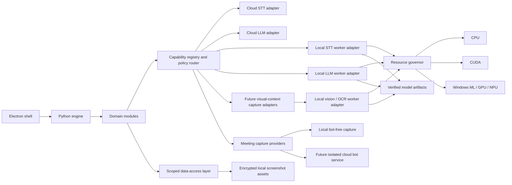

# Future Capability Architecture Proposal

**Status:** Proposed for founder approval under OD-18; no screenshot capture/storage, dependency, model, cloud service, or production code is authorized by this document  
**Date:** 2026-08-04  
**Scope:** Long-term extension seams for local AI, local visual context, meeting intelligence, and holistic personal modules

## Objective

Ascend should be able to grow for many years without turning the trusted engine into one tightly coupled program or forcing personal data into organization features.

The long-term personal vision spans:

- **work:** dictation, meetings, productivity, tasks, calendar, memory, and collaboration;
- **mind:** reflection, learning, coaching, focus, and mental-wellbeing tools;
- **body:** health, movement, yoga, sleep, and habit support;
- **energy:** workload, recovery, routines, and user-defined energy patterns;
- **spiritual wellbeing:** private reflection and user-defined practices without imposing a belief system.

The work product is the v1 wedge. The other domains are optional future modules, not v1 commitments. Personal wellness, health, voice identity, and spiritual data must never become organization-visible merely because a person joins a workspace.

This proposal creates architectural seams for:

- future local transcription models, including NVIDIA Parakeet-family candidates;
- future local language-model runtimes, including llama.cpp-family candidates;
- CPU, NVIDIA CUDA, Windows ML, GPU, NPU, and later execution paths;
- cloud and local processing under an explicit user data-locality policy;
- future opt-in screenshot capture, encrypted local retention, and local vision/OCR analysis;
- a future cloud meeting bot that can act on calendar events;
- future speaker diarization and cautious name/identity resolution;
- future health, wellness, mind, energy, and spiritual modules.

It deliberately does **not** capture or store screenshots, select or add a runtime, download a model, build a bot, create cloud infrastructure, create health schemas, or expose a third-party plugin SDK.

## Assumptions

1. Ascend remains Windows-first through v1.
2. The Electron shell remains thin and the Python engine remains the sole application-database owner.
3. A future native or model worker may use another language or runtime, but it does not receive database access.
4. Local and cloud backends can produce different quality, latency, cost, and privacy outcomes; the route must be visible.
5. Hardware progress is unpredictable. Ascend must use capability probes and measurements rather than a fixed assumption about model parameter count or GPU size.
6. “Plug-and-play” means an approved adapter satisfies a narrow contract and conformance suite. It does not mean arbitrary code receives trusted in-process access.

## Source-driven feasibility

The proposal uses current sources to prove that multiple runtime paths are plausible without selecting one:

- [llama.cpp](https://github.com/ggml-org/llama.cpp) exposes a local file path, an OpenAI-compatible server, CPU execution, quantization, CUDA, HIP, Vulkan, SYCL, and CPU/GPU hybrid paths.
- [NVIDIA NeMo](https://docs.nvidia.com/nemo/speech/nightly/asr/asr_checkpoints.html) lists Parakeet-family ASR checkpoints; the current [NVIDIA Parakeet model card](https://huggingface.co/nvidia/parakeet-tdt-0.6b-v3) shows that model files, languages, licenses, and runtime needs change over time.
- [ONNX Runtime execution providers](https://onnxruntime.ai/docs/execution-providers/) use one API across CPU, CUDA, DirectML, OpenVINO, QNN, and other providers.
- Microsoft now recommends [Windows ML for Windows ONNX deployment](https://onnxruntime.ai/docs/get-started/with-windows.html), with dynamic execution-provider selection on newer Windows systems.
- Microsoft documents [Windows AI Foundry and local model APIs](https://learn.microsoft.com/en-us/windows/ai/overview) as an evolving Windows-managed path; this remains a candidate rather than a dependency decision.
- [whisper.cpp](https://github.com/ggml-org/whisper.cpp/blob/master/README.md) demonstrates another CPU/GPU/Vulkan/OpenVINO ASR runtime shape.
- Microsoft documents [`Windows.Graphics.Capture`](https://learn.microsoft.com/en-us/windows/apps/develop/media-authoring-processing/screen-capture) as a Windows desktop path for user-selected display or application-window frames with system capture UI and a visible capture border.
- Microsoft documents local [Windows AI imaging APIs](https://learn.microsoft.com/en-us/windows/ai/apis/imaging), including image description, but current hardware and packaging requirements exclude many Windows PCs. This is evidence for a provider-neutral local-vision seam, not selection of a Windows-managed model.
- The current [`Windows.Media.Ocr`](https://learn.microsoft.com/en-us/uwp/api/windows.media.ocr) documentation carries desktop package-identity constraints. Historical OCR recommendations must therefore be re-verified against Ascend's eventual packaging route rather than treated as approved implementation guidance.
- Public [llama.cpp issues](https://github.com/ggml-org/llama.cpp/issues) also show why backend selection cannot be treated as permanently reliable: driver-specific crashes, memory failures, missing release artifacts, and performance regressions occur.
- Hugging Face warns that [pickle model files can execute arbitrary code when loaded](https://huggingface.co/docs/hub/security-pickle). Model acquisition is therefore a supply-chain boundary, not an ordinary file download.

Historical Ascend donor evidence also includes an isolated Parakeet/ONNX worker and a llama.cpp child-server experiment. Those measurements were useful on one RTX 4060 system but are not general product evidence and do not select the future Ascend implementation.

## Core design decision

Use a **capability-oriented modular architecture** with five distinct concepts:

1. **Domain module:** owns product meaning, policy, and use cases.
2. **Capability contract:** a stable typed request/result boundary.
3. **Provider adapter:** maps a cloud service, local runtime, Windows API, or meeting platform into that contract.
4. **Isolated worker:** hosts crash-prone, dependency-heavy, native, or model-specific execution.
5. **Artifact and resource manager:** verifies model/runtime assets and governs CPU, RAM, GPU, NPU, disk, battery, and concurrency.

No domain module selects CUDA, calls llama.cpp directly, understands Parakeet file layout, or imports a provider SDK. It requests a capability and receives a typed result plus an execution receipt.

## Architectural shape



The cloud bot is outside the local trust boundary. Local model workers are outside the database boundary. The capability registry is policy and routing code, not a language model.

## Contract vocabulary

The exact implementation types require a separately approved task, but every capability contract must include the following fields and semantics.

### Capability descriptor

- `capability_id`: stable namespaced identifier such as `speech.transcribe.batch` or a future `vision.screen.describe.local`;
- `contract_version`: one current supported version, extended additively;
- `input_kinds` and `output_kinds`;
- local, cloud, or capture-provider route;
- supported language, streaming, timestamps, diarization, structured-output, and cancellation features;
- privacy/data classes accepted by the backend;
- required scopes, devices, runtime, model artifacts, and compute;
- functional health state and last validated time;
- known limitations and degradation codes.

### Capability request

- actor, tenant, workspace, device, and operation IDs;
- requested capability and contract version;
- input asset references rather than unrestricted paths;
- data classification and visibility;
- user routing policy: local-only, cloud-only, or explicitly configured automatic choice;
- quality/latency/cost constraints;
- cancellation token, deadline, and resource budget;
- source and user intent.

### Capability result

Use one discriminated result shape:

- `succeeded`;
- `degraded`, with usable output and explicit limitations;
- `failed`, with stable reason code and retry guidance;
- `cancelled`, with recoverable partial assets identified.

Raw native exceptions, provider payloads, model output, and stack traces never become the contract.

### Execution receipt

Every result records:

- local/cloud/capture route;
- adapter, runtime, model, artifact revision, and configuration versions;
- execution-provider and device class without leaking unnecessary hardware identity;
- start/end time, input/output hashes where appropriate, and cancellation state;
- gaps, fallback decisions, degradation, retries, and final reason code;
- cost/token/audio-duration accounting where applicable;
- provenance linking the result to the original source and later correction.

The receipt is operational provenance. It is not permission to log transcript, prompt, audio, health content, or model output.

## Internal module contract

Each built-in module declares a reviewed manifest containing:

- module ID and version;
- domain and data classifications;
- capability dependencies;
- user-visible permissions;
- allowed storage repositories and migrations;
- allowed background jobs;
- allowed API/MCP/export/search surfaces;
- UI contribution points;
- resource budgets;
- retention/deletion behavior;
- organization-sharing policy;
- conformance-test version.

Initially, only built-in, allowlisted modules ship. A manifest describes code that Ascend itself reviewed; it does not authorize dynamically downloaded code.

An external plugin ecosystem would require a separate security design for signing, sandboxing, update/revocation, capability grants, storage isolation, UI isolation, billing, and incident response. It is intentionally out of scope.

## Local inference boundary

### 1. Model runtimes stay behind adapters

Candidate adapters may eventually include:

- llama.cpp or another local language-model server;
- a Parakeet/NeMo/ONNX transcription worker;
- whisper.cpp or another CPU/cross-vendor transcription runtime;
- Windows ML or Foundry Local;
- a provider-specific native SDK.

No candidate is selected by this proposal. Each requires current official-source research, a pinned version, license review, dependency/toolchain approval, a threat-model update, and a proof on supported Windows hardware.

### 2. Dependency-heavy runtimes are isolated

A local model worker:

- is a supervised unprivileged child process or separately signed helper;
- binds only to an authenticated per-session local channel;
- receives a narrow request and a brokered input handle, not arbitrary filesystem access;
- cannot open Ascend’s database, credential store, general MCP server, or provider grants;
- has bounded CPU, RAM, VRAM, queue, time, and concurrency;
- emits typed health and progress events;
- supports cancellation and bounded shutdown;
- can crash or be killed without crashing the shell or corrupting trusted state;
- is replaceable without changing the domain contract.

The exact Windows isolation mechanism remains a future native/security decision. “Localhost” alone is not an authorization boundary.

### 3. Model artifacts are untrusted supply-chain inputs

Every approved model artifact uses a manifest with:

- stable artifact ID, model family, task, and revision;
- origin and immutable upstream revision;
- expected files, sizes, and cryptographic hashes;
- signature/provenance evidence when available;
- license and use restrictions;
- format and runtime compatibility;
- supported languages/capabilities;
- minimum and recommended disk, RAM, VRAM, OS, driver, and backend requirements;
- evaluation-set version and known limitations;
- rollback target and support state.

Artifact lifecycle states are:

`absent -> acquiring -> verifying -> ready -> loading -> active`

with explicit `degraded`, `quarantined`, `failed`, `update_available`, and `removing` branches.

Requirements:

- no arbitrary pickle loading or remote model code in the normal product;
- no `trust_remote_code` equivalent by default;
- download to a staging location with size/time limits;
- resumable acquisition where selected;
- verify before atomic promotion;
- quarantine mismatches;
- preserve the prior known-good revision for rollback;
- show download size, disk requirement, license, data path, and expected hardware before consent;
- never silently download a model or runtime;
- never commit models or runtime artifacts to the public repository.

Whether a model is bundled, Windows-managed, or downloaded on demand is a per-artifact product decision. The historical donor documents made conflicting choices; Ascend keeps the mechanism flexible and defers the policy until installer size, offline-first value, licensing, update cadence, and failure evidence are current.

### 4. Hardware selection is evidence-driven

A `ComputeInventory` and `ResourceGovernor` will eventually:

- discover CPU instruction support, RAM, GPU/NPU adapters, driver/runtime versions, and usable execution providers;
- identify multiple GPUs by stable adapter identity rather than assuming device 0 is fastest;
- perform a functional load and bounded benchmark for the exact model/runtime/backend combination;
- keep results scoped to OS, driver, runtime, model, and adapter revision;
- invalidate stale evidence after relevant updates;
- estimate memory and disk headroom conservatively;
- queue or reject work before exhausting the machine;
- give real-time capture higher priority than background summarization;
- reduce or pause background work under battery, sleep, thermal pressure, or user policy;
- expose a visible CPU or other approved fallback only when it satisfies the user’s routing and quality policy.

No architecture decision depends on a prediction that a particular parameter count will run on a future laptop.

### 5. Local/cloud routing is explicit

The user can eventually choose per capability:

- **local only:** input never leaves the device;
- **cloud only:** use the named provider under its disclosure and cost controls;
- **automatic:** choose among explicitly approved routes using the saved policy and show the route in the result.

A route change never bypasses consent, data classification, workspace scope, or cost limits. Local failure cannot silently send health data, meeting audio, transcripts, or private work to a cloud provider.

If a local transcription fails, the capture asset remains recoverable under the approved storage/retention policy. If cloud processing fails, the job remains retryable or can be redirected only under the saved user policy.

## Future local visual context

OD-20 preserves a future visual-context route because screenshots can provide information that accessibility trees, window titles, and text-only OCR miss. It does not add screenshot capture to v1 or approve a concrete API, cadence, model, runtime, dependency, schema, or real-data test.

### Capture modes remain distinct

The eventual feature must not collapse these modes into one ambient permission:

1. **Accessibility and window metadata:** semantic text, control roles, application identity, title, and focus state without retaining pixels.
2. **Transient local frame:** a frame exists only long enough for approved local OCR or safety evaluation and is not persisted.
3. **Retained local screenshot:** a user-enabled application window, display, or region is captured as an encrypted personal asset for later local analysis and review.

Enabling one mode does not enable another. Retained screenshots are never an invisible fallback when accessibility or OCR coverage is weak.

### Local-only data flow

```text
user-approved target and capture policy
    -> pre-capture application/window/session exclusions
    -> Windows capture adapter
    -> in-memory quarantined frame
    -> trusted-engine validation and encrypted local screenshot asset when retention is allowed
    -> brokered read-only handle to isolated local vision/OCR worker
    -> validated derived observation plus execution receipt
    -> tenant/workspace-scoped persistence by the trusted engine
```

Raw pixels do not travel to a cloud model, connection service, remote telemetry, support bundle, or unrelated external client. Local-model failure is a visible failed/degraded result, not permission to upload. The worker has no general network, SQLite, credential-store, MCP, provider-grant, or unrelated filesystem authority.

### Capture, storage, and privacy controls

Before production use, the feature specification must define and prove:

- off-by-default onboarding with an authoritative visible capture state, pause/stop shortcut, private mode, and fail-closed lock/session/indicator behavior;
- application, executable, account/profile, window, site/private-mode where reliably detectable, display, and region allow/exclude rules evaluated before persistence wherever possible;
- explicit cadence or event triggers, duplicate suppression, daily storage budget, disk reserve, battery/thermal policy, and capture/inference priority;
- encryption before any real screenshot touches durable storage, including thumbnails, caches, temporary files, indexes, backups, and crash recovery;
- per-source retention, review, deletion, export, and derived-data cascade behavior;
- a separate restricted data class for raw screenshots and a separately classified derived visual observation;
- no default organization visibility, general API/MCP/export/search access, diagnostic inclusion, or unrelated AI-context inclusion;
- honest residual-risk wording: local-only storage does not prevent exposure to same-user malware, an unlocked Windows session, backups, or a screenshot that contains a secret before a detector can identify it.

Password and sensitive-content detection are defense in depth, not a guarantee. A password manager, revealed password, one-time code, terminal secret, private message, financial page, or health record can appear as ordinary pixels. The feature must therefore combine pre-capture exclusions, local pre-persistence checks where feasible, short retention options, and user controls rather than claiming perfect redaction.

### Vision results are derived evidence

A local vision or OCR result is untrusted derived data. It records source screenshot identity, capture policy version, crop/region, adapter/runtime/model/configuration revision, time, confidence, limitations, and correction lineage. Model output cannot directly create facts, permissions, actions, or external writes. The raw screenshot remains the source asset under its own retention and access policy.

Windows-managed image description, a custom ONNX vision model, or another local runtime may later satisfy the capability. None is selected here. Hardware coverage, model quality, license, package identity, storage/download size, inference latency, and screenshot-specific evaluations must be current and approved before implementation.

### Decisions deliberately deferred

The later feature specification must choose the default capture target, periodic versus event-driven cadence, retention duration, compression and quality, multi-monitor behavior, screenshot timeline/search UX, export policy, sensitive-content handling, local model/runtime, minimum hardware, and whether retained screenshots are ever included in a user-initiated local-only model request. Migration 0001 must not pre-build screenshot tables.

## Future meeting-capture providers

The canonical meeting domain must not assume that capture came from the current laptop.

### Capture-source contract

A `MeetingCaptureProvider` may eventually represent:

- `local_bot_free`: microphone plus system/process audio on the user’s device;
- `cloud_bot`: a separately hosted participant joining a supported meeting;
- `provider_artifact_import`: an authorized meeting platform’s recording/transcript;
- `file_import`: an explicitly selected local artifact.

Every provider produces the same canonical meeting assets and segments, but provenance remains distinct. Local and cloud assets are not silently merged.

### Cloud-bot trust boundary

A future cloud meeting bot is a separate service with its own:

- tenant/workspace authorization;
- per-user calendar/meeting grant;
- meeting-platform registrations and credentials;
- regional processing/storage policy;
- admission and recording-consent policy;
- idempotency, rate, capacity, and cost controls;
- audit, retention, deletion, incident response, and support boundary.

The desktop cannot become the bot service by accident. Bot credentials and media never share the local engine session token or inbound Ascend MCP grants.

Current provider documentation shows why this remains a future specialized system. tl;dv documents waiting-room, authentication, scheduling, duplicate-bot, and duration failures. Microsoft states that [application-hosted Teams media bots require significant infrastructure](https://learn.microsoft.com/en-us/microsoftteams/platform/bots/calls-and-meetings/real-time-media-concepts). Google’s [Meet API](https://developers.google.com/workspace/meet/api/guides/overview) exposes meeting records, participants, recordings, and transcripts, but this is not a universal cross-provider join mechanism.

### Bot state machine

Each bot attempt has a durable identity and these explicit states:

- proposed;
- scheduled;
- join_queued;
- joining;
- waiting_for_admission;
- admitted;
- capturing;
- stopping;
- processing;
- ready;
- degraded;
- failed;
- cancelled.

An idempotency key includes the tenant, workspace, calendar occurrence, meeting provider, capture policy version, and intended bot identity. This prevents duplicate joins from retries or multiple devices.

Calendar discovery never equals consent to record. The user sees and controls the rule that proposes or schedules a bot. Auto-join, participant notice, recording, sharing, follow-up, and deletion are separate policies.

Local and bot capture cannot both claim authoritative ownership of the same meeting without an explicit conflict flow.

## Speaker diarization and identity

Diarization answers “which anonymous voice spoke?” Identity resolution answers “which person might that voice represent?” These are separate pipelines.

### Canonical speaker identity

Every transcript begins with stable anonymous speaker IDs. Name evidence is attached separately:

- separate local microphone stem identifying “You”;
- authenticated meeting-platform participant identity when the capture provider supplies a trustworthy mapping;
- explicit user selection or correction;
- exact saved alias;
- calendar attendee candidate;
- self-introduction or transcript evidence;
- optional future voice-profile similarity;
- optional future on-screen participant-name evidence.

Each candidate records source, confidence, time range, model/rule version, and conflicts. Only a separately approved confidence policy can change the displayed name automatically. Ambiguity remains “Speaker 2,” not an invented person.

User correction is durable, reversible, and survives reprocessing. A correction to one meeting does not automatically merge two people globally.

### Voice-profile boundary

Voice embeddings or profiles are treated as restricted biometric-like data regardless of the minimum legal definition in a particular jurisdiction:

- explicit opt-in enrollment;
- purpose-limited to speaker assistance;
- encrypted storage before real use;
- separate repository and serialization blocklist;
- no general search, organization analytics, logs, support bundles, API, MCP, export, or model-training path;
- user-visible delete/reset;
- retention and offboarding rules;
- qualified legal/privacy review before implementation or launch.

Screen/window reading for participant names is also a separately gated capture capability. It cannot be enabled merely because meeting transcription exists.

## Holistic personal modules

### Domain separation

Future work, mind, body, energy, wellness, and spiritual features share identity and permission foundations but do not share data implicitly.

At minimum, future policy distinguishes:

- ordinary personal work data;
- sensitive wellbeing/health data;
- restricted biometric/voice-profile data;
- private reflection or spiritual-practice data;
- deliberately shared workspace work data;
- organization-owned work data.

Generic memory search, AI context assembly, API/MCP, export, support bundles, analytics, and organization sharing are deny-by-default for sensitive personal domains. Cross-domain use requires a specific user-visible grant and purpose.

### Health and wellness boundaries

Before a health/wellness module exists:

- define whether it is habit/wellness support or a regulated medical function;
- prohibit diagnostic, treatment, crisis, or clinical claims unless separately qualified and approved;
- obtain qualified legal, privacy, clinical-safety, accessibility, and content review appropriate to launch jurisdictions;
- define source accuracy, user correction, emergency limitations, retention, deletion, and data export;
- encrypt real data and isolate permissions;
- prohibit employer, manager, or organization access by default;
- prohibit employee-health scoring, spiritual profiling, insurance/employment decisions, or hidden inference;
- keep remote telemetry off by default and exclude content from diagnostics;
- validate any device/wearable/provider data as untrusted and revocable.

These modules may use the shared capability registry, but they cannot inherit work-module permissions, provider grants, prompts, search indexes, or organization visibility.

## Reliability and fault model

The public failure corpus in `docs/COMPETITOR-FAILURE-RESEARCH-2026-07-19.md` becomes a maintained test input.

Every capability adapter must pass:

1. **Contract conformance:** schema, reason codes, progress, cancellation, receipts, and additive version behavior.
2. **Isolation:** no database, credential, unrelated workspace, or arbitrary file access.
3. **Lifecycle:** start, readiness, use, cancellation, crash, restart, sleep/wake, update, shutdown, and uninstall.
4. **Resource pressure:** low disk/RAM/VRAM, queue limits, thermal/battery policy, and concurrent capture.
5. **Backend failure:** missing artifacts, bad hashes, unsupported runtime, provider outage, driver regression, malformed output, and timeout.
6. **Privacy routing:** local-only never transmits; cloud disclosure matches the actual route; sensitive domains fail closed.
7. **Provenance:** result can be traced to input, capture source, route, model/runtime/config revision, gaps, and correction.
8. **Rollback:** prior known-good runtime/model/provider profile remains recoverable when an update fails.

No adapter is production-ready from unit tests alone. Named Windows hardware/runtime combinations need a dated support matrix and real evidence using synthetic or explicitly approved test data.

## Build now versus build later

### Preserve now

- capability, capture-source, and execution-provenance concepts in specifications;
- provider-neutral domain models;
- explicit local/cloud/data-class policy seams;
- isolated-worker trust boundary;
- stable reason-code and degraded-state vocabulary;
- tenant/workspace/owner/visibility/audit context;
- one resource-arbitration direction for capture and future inference;
- source/version/correction lineage in later approved product schemas;
- a distinct future visual-context capture/data-class seam with a local-only route;
- fault-injection requirements derived from the competitor corpus.

### Build only with the first relevant approved slice

- concrete capability registry types and fake adapters;
- execution receipt storage;
- resource governor behavior;
- model artifact manager;
- local STT or LLM worker;
- retained screenshot storage, a local vision/OCR worker, and visual-context indexes;
- Windows ML, CUDA, llama.cpp, Parakeet, or other runtime adapter;
- cloud bot service and provider-specific join logic;
- speaker identity/profile storage;
- health/wellness schemas and UI;
- external plugin SDK.

This avoids both extremes: a provider-specific tangle and a speculative framework with no proven consumer.

## Acceptance criteria for the architecture

Before any local model or future module implementation is accepted:

- adding a new approved STT backend does not change dictation or meeting-domain behavior;
- adding a new approved LLM backend does not give it database, credential, or tool authority;
- switching local/cloud route follows explicit policy and creates a truthful execution receipt;
- a worker crash cannot crash the shell, open the database, or destroy the only recoverable input;
- a model/runtime revision is pinned, verified, licensed, resource-bounded, and rollback-capable;
- a future screenshot path is opt-in, encrypted, local-only, visibly active, exclusion-aware, retention-bound, and unable to expose raw pixels through cloud fallback or general organization/API/MCP/diagnostic paths;
- a cloud bot and local capture can produce the same canonical meeting shape while retaining distinct provenance;
- speaker names remain evidence-based, correctable, and allowed to stay unknown;
- voice profiles, wellbeing, health, and spiritual data are not reachable through generic work search, organization access, API, MCP, export, or diagnostics without an explicit future grant;
- every relevant competitor failure class has a named test, visible recovery state, or documented unsupported boundary.

## Implementation sequence

1. Approve this proposal, OD-18, and proposed ADR-0004.
2. Keep Task 4 and the approved Milestone 0 dependency order unchanged.
3. In migration-0001 and the core DAL, preserve tenant/workspace/owner/audit foundations only; do not pre-build model, bot, speaker-profile, or health tables.
4. Before the first production transcription/AI slice, specify the exact capability contract and execution receipt with fake local/cloud adapters.
5. Select one concrete runtime only after current official-source, license, dependency, packaging, security, and Windows hardware research.
6. Implement one vertical slice with TDD, fault injection, resource limits, and an approved hardware matrix.
7. Add later adapters one at a time through the same conformance suite.
8. Specify cloud bot, speaker identity, and health/wellness as separate high-risk product milestones with their own human approvals.
9. Specify retained screenshots and local vision as a separate high-risk visual-context milestone after the baseline screen-context spike, encrypted storage, OD-20 controls, and an approved model/runtime proof.

## Approval requested

Approval accepts the capability/module boundaries, isolation principles, provenance, data-class separation, future capture-source model including OD-20's local visual-context seam, and planning sequence. It does not approve screenshot capture/storage, a dependency, model download, model license, runtime, cloud service, provider account, health-data collection, voice-profile enrollment, real data, spending, distribution, or deployment.

Recommended approval text:

```text
Approved: FUTURE-CAPABILITY-ARCHITECTURE-PROPOSAL. Adopt OD-18 and ADR-0004. Preserve OD-20's future opt-in encrypted local screenshot and local-vision seam, but keep screenshot capture/storage, local-model, cloud-meeting-bot, speaker-identity, and holistic health/wellness implementation out of the current foundation; each requires a separately specified and approved release scope. Implement only the shared capability, provenance, failure, isolation, and data-class seams alongside the first relevant approved production slice; do not add a runtime, dependency, model, cloud resource, credential, real data, or external plugin system through this approval.
```
